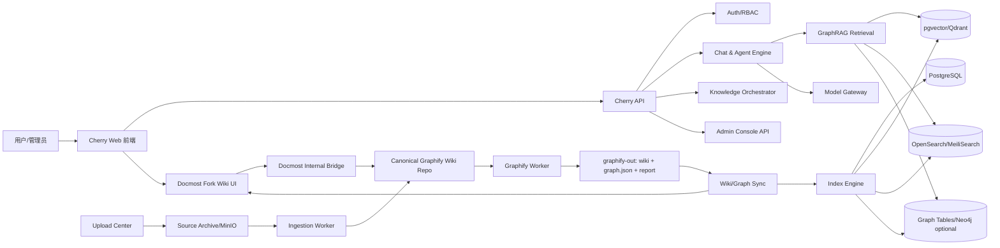

# CherryGraph Studio 方案文档包

版本：v0.3  
日期：2026-04-28  
定位：基于 Cherry Studio 社区版 Fork 重构的 Docker 化 Web 端，强耦合 Graphify Wiki、Docmost Fork 协作编辑和 GraphRAG 能力。

## 1. 方案一句话

本项目不是把 Cherry Studio 桌面端简单搬到浏览器，而是以 Cherry Studio 的体验和能力为基础，重构为一套多用户 Web AI 工作台：

```text
Cherry Studio Web
= 多用户 AI 聊天与 Agent 工作台
+ Graphify Wiki 唯一知识源
+ Docmost Fork 协作编辑壳层
+ 上传资料自动归档/解析/生成 Wiki
+ Graphify 自动图谱化与 Wiki 同步
+ Vector/BM25/GraphRAG 检索
+ 管理后台、权限、审计、Docker 部署
```

## 2. 已确认路线

| 编号 | 决策 |
|---|---|
| D1 | Fork 开源 Cherry Studio，路线 A，重构 Web 版 |
| D2 | Graphify CLI 由 Cherry Web 后台自动调度 |
| D3 | 不考虑内网模型限制，按互联网可用模型处理 |
| D4 | Docmost Fork 开源版 + 自建 Bridge endpoint，不购买企业版 |
| D5 | Graphify Wiki 是唯一信息源 |
| D6 | 认可六层耦合 |
| D7 | Wiki 支持人工修订、上传资料自动归档解析、同步 Graphify |
| D8 | 内部小团队使用，非 SaaS |
| D9 | 源码全部公开 |
| D10 | 不设 MVP，分阶段交付成品 |
| D11 | Phase 1 先不上 Docmost |
| D12 | Phase 1-3 使用 PostgreSQL 图表，Neo4j 预留 |

## 3. 文档索引

### architecture/ — 架构与总体设计

| 文件 | 内容 |
|---|---|
| [01_方案总览与边界](architecture/01_方案总览与边界.md) | 项目定位、边界、术语、成功标准 |
| [02_总体架构设计](architecture/02_总体架构设计.md) | 服务拆分、数据流、存储分层、Cherry Studio 改造策略 |
| [08_强耦合设计_六层](architecture/08_强耦合设计_六层.md) | 六层耦合定义、验收矩阵、一致性保障 |

### requirements/ — 需求与模块

| 文件 | 内容 |
|---|---|
| [03_产品需求_PRD](requirements/03_产品需求_PRD.md) | 用户角色、用户故事、功能矩阵、非功能需求 |
| [04_CherryWeb_Chat_Admin](requirements/04_模块需求_CherryWeb_Chat_Admin.md) | 前端、Chat 引擎、管理后台 |
| [05_GraphifyWiki唯一知识源](requirements/05_模块需求_GraphifyWiki唯一知识源.md) | Canonical Wiki Repo、Frontmatter、合并流水线 |
| [06_Docmost集成](requirements/06_模块需求_Docmost集成.md) | Fork 策略、双向同步、Bridge 路由、权限映射 |
| [07_资料上传归档解析](requirements/07_模块需求_资料上传归档解析.md) | 上传入口、安全校验、解析、分类、Graphify 触发 |

### design/ — 技术设计

| 文件 | 内容 |
|---|---|
| [09_RAG与GraphRAG设计](design/09_RAG与GraphRAG设计.md) | 检索源、混合检索、置信度模型、Prompt 组装 |
| [10_数据模型与数据库设计](design/10_数据模型与数据库设计.md) | ER 关系、表结构、ACL 信封、版本一致性 |
| [11_API规范](design/11_API规范.md) | RESTful API、SSE、Docmost Bridge 内部 API |
| [21_Graphify输出Schema契约](design/21_Graphify_输出Schema契约.md) | graph.json/wiki/report 契约、校验规则、降级策略 |

### engineering/ — 工程规范

| 文件 | 内容 |
|---|---|
| [12_权限安全审计](engineering/12_权限安全审计.md) | RBAC、Space 隔离、检索安全、审计日志 |
| [13_开发规范](engineering/13_开发规范.md) | 仓库结构、技术栈、编码规范、PR 要求 |
| [14_测试验收规范](engineering/14_测试验收规范.md) | 测试层级、核心场景、性能指标 |
| [15_部署运维规范](engineering/15_部署运维规范.md) | Docker Compose、健康检查、备份恢复、监控 |

### project/ — 项目管理

| 文件 | 内容 |
|---|---|
| [16_实施路线图与里程碑](project/16_实施路线图与里程碑.md) | Phase 1-4 交付物、退出标准、工作量 |
| [17_风险清单与决策记录](project/17_风险清单与决策记录.md) | R1-R14 风险、ADR-001 至 ADR-009 |
| [18_开源许可证与合规](project/18_开源许可证与合规说明.md) | AGPL 合规、SBOM、许可证声明 |
| [19_资料依据与外部来源](project/19_资料依据与外部来源.md) | Cherry Studio/Graphify/Docmost 参考信息 |
| [23_补充建议清单](project/23_补充建议清单.md) | 安全、可观测性、数据治理补充建议 |

### audit/ — 代码审计与集成

| 文件 | 内容 |
|---|---|
| [20_Cherry Studio代码审计](audit/20_Cherry_Studio_代码审计.md) | 345K LOC 实际扫描、A/B/C 复用评级 |
| [22_Docmost Fork改动清单](audit/22_Docmost_Fork_改动清单.md) | baseline v0.80.1、Bridge 路由、rebase 流程 |

### 可执行参考件

| 文件 | 内容 |
|---|---|
| [docker-compose.skeleton.yml](ops/docker-compose.skeleton.yml) | Docker Compose 骨架 |
| [env.example](ops/env.example) | 环境变量样例 |
| [nginx.conf.example](ops/nginx.conf.example) | Nginx 反向代理 |
| [schema.sql](schemas/schema.sql) | 数据库 Schema 草案 |
| [openapi.yaml](schemas/openapi.yaml) | OpenAPI 草案 |
| [todo.md](todo.md) | TODO 合并状态 |
| [templates/](templates/) | ADR、模块需求、验收用例模板 |

## 4. 总体架构速览



## 5. 项目仓库结构

```text
CherryWiki/
  docs/                     ← 本文档包
    architecture/           ← 架构与总体设计
    requirements/           ← 需求与模块
    design/                 ← 技术设计
    engineering/            ← 工程规范
    project/                ← 项目管理
    audit/                  ← 代码审计与集成
    schemas/                ← SQL / OpenAPI
    ops/                    ← Docker / Nginx / env
    templates/              ← ADR / 需求 / 验收模板
  external/                 ← 第三方 Fork（submodule）
    cherry-studio/          ← DankerMu/cherry-studio
    graphify/               ← DankerMu/graphify
    docmost/                ← DankerMu/docmost
```
