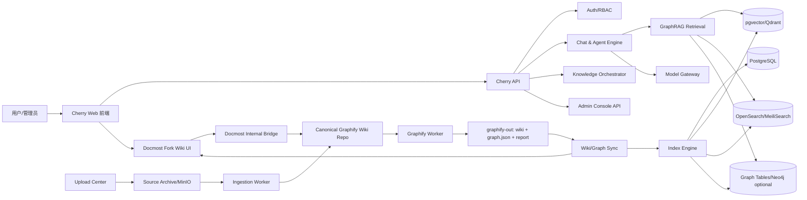

# CherryGraph Studio 方案文档包

版本：v0.2-todo-merged  
日期：2026-04-28  
定位：基于 Cherry Studio 社区版 Fork 重构的 Docker 化 Web 端，强耦合 Graphify Wiki、Docmost Fork 协作编辑和 GraphRAG 能力。

## 1. 方案一句话

本项目不是把 Cherry Studio 桌面端简单搬到浏览器，而是以 Cherry Studio 的体验和能力为基础，重构为一套多用户 Web AI 工作台：

```text
Cherry Studio Web
= 多用户 AI 聊天与 Agent 工作台
+ Graphify Wiki 唯一知识源
+ Docmost Fork 协作编辑壳层
+ 上传资料自动归档/解析/生成 Wiki
+ Graphify 自动图谱化与 Wiki 同步
+ Vector/BM25/GraphRAG 检索
+ 管理后台、权限、审计、Docker 部署
```

## 2. 已确认路线

| 编号 | 决策 | 本文档处理方式 |
|---|---|---|
| D1 | Fork 开源 Cherry Studio，路线 A，重构 Web 版 | 以“重构”而不是“Electron 直改”为前提，保留 Cherry 聊天、模型、知识库、MCP、Agent 等核心体验。 |
| D2 | Graphify CLI 由 Cherry Web 后台自动调度 | 设计 `graphify-worker`、任务队列、运行记录、输出解析、索引更新。 |
| D3 | 不考虑内网模型限制，按互联网可用模型处理 | 模型网关仍作为抽象层保留，便于未来切换。 |
| D4 | Docmost 作为 Wiki 网页 | 使用 Fork 开源版 + 自建 Bridge endpoint，不购买企业版；Docmost 是 Graphify Wiki 的编辑/协作/权限前端。 |
| D5 | Graphify Wiki 是唯一信息源 | 聊天检索只从发布后的 Graphify Wiki 页面与其派生图谱/索引取材；上传原文只作为证据、归档和再生成输入。 |
| D6 | 认可六层耦合 | 形成数据源、索引、检索、UI、Agent、权限六层强耦合。 |
| D7 | Wiki 支持人工修订、上传资料自动归档解析、同步 Graphify | 增加 Wiki 修订流、上传归档流、Graphify 增量更新流和冲突合并机制。 |
| D8 | 内部小团队使用，非 SaaS | 仍保留 tenant 字段作为扩展和权限边界，但 Phase 1 默认单 tenant。 |
| D9 | 源码全部公开 | AGPL 合规风险降级，保留许可证页面、SBOM、源码入口和 license bundle。 |
| D10 | 不设 MVP，分阶段交付成品 | Phase 1 定义为最小可用成品，不使用“实验性 MVP”口径。 |
| D11 | Phase 1 先不上 Docmost | Phase 1 使用 Cherry Web 内置只读 Wiki；Phase 2 再接入 Docmost Fork 双向协作编辑。 |
| D12 | Phase 1-3 使用 PostgreSQL 图表，Neo4j 预留 | `graph-core` 通过 Repository 接口屏蔽 PG/Neo4j 差异。 |

## 3. 文档索引

### 需求与产品

1. [方案总览与边界](docs/01_方案总览与边界.md)
2. [产品需求 PRD](docs/03_产品需求_PRD.md)
3. [模块需求：Cherry Web、Chat、Admin](docs/04_模块需求_CherryWeb_Chat_Admin.md)
4. [模块需求：Graphify Wiki 唯一知识源](docs/05_模块需求_GraphifyWiki唯一知识源.md)
5. [模块需求：Docmost 集成](docs/06_模块需求_Docmost集成.md)
6. [模块需求：资料上传、归档、解析](docs/07_模块需求_资料上传归档解析.md)

### 架构与技术

7. [总体架构设计](docs/02_总体架构设计.md)
8. [六层强耦合设计](docs/08_强耦合设计_六层.md)
9. [RAG 与 GraphRAG 设计](docs/09_RAG与GraphRAG设计.md)
10. [数据模型与数据库设计](docs/10_数据模型与数据库设计.md)
11. [API 规范](docs/11_API规范.md)
12. [权限、安全与审计](docs/12_权限安全审计.md)
13. [Cherry Studio 代码审计](docs/20_Cherry_Studio_代码审计.md)
14. [Graphify 输出 Schema 契约](docs/21_Graphify_输出Schema契约.md)
15. [Docmost Fork 改动清单](docs/22_Docmost_Fork_改动清单.md)

### 工程与交付

16. [开发规范](docs/13_开发规范.md)
17. [测试与验收规范](docs/14_测试验收规范.md)
18. [部署与运维规范](docs/15_部署运维规范.md)
19. [实施路线图与里程碑](docs/16_实施路线图与里程碑.md)
20. [风险清单与决策记录](docs/17_风险清单与决策记录.md)
21. [开源许可证与合规说明](docs/18_开源许可证与合规说明.md)
22. [资料依据与外部来源](docs/19_资料依据与外部来源.md)
23. [补充建议清单](docs/23_补充建议清单.md)

### 可执行参考件

- [Docker Compose 骨架](ops/docker-compose.skeleton.yml)
- [环境变量样例](ops/env.example)
- [Nginx 反向代理样例](ops/nginx.conf.example)
- [数据库 Schema 草案](schemas/schema.sql)
- [OpenAPI 草案](schemas/openapi.yaml)
- [TODO 合并状态](todo.md)
- [ADR 模板](templates/ADR_TEMPLATE.md)
- [模块需求模板](templates/MODULE_REQUIREMENT_TEMPLATE.md)
- [验收用例模板](templates/ACCEPTANCE_CASE_TEMPLATE.md)

## 4. 总体架构速览



## 5. 核心原则

1. **Graphify Wiki 是唯一知识源**：AI 回答基于发布后的 Wiki 页面、页面切片、图谱节点和关系；原始上传文件不是直接检索源。
2. **Docmost 是协作编辑壳层**：Docmost 提供多人编辑、页面历史、附件、Spaces、权限 UI；内容需同步回 Canonical Graphify Wiki Repo 后才可发布和索引。
3. **Graphify 是平台内置索引器**：不让用户手动跑 CLI；后台通过任务队列自动调用 Graphify，解析 `graph.json`、`GRAPH_REPORT.md` 和 `wiki/`。
4. **生成内容不能静默覆盖人工修订**：Graphify 新生成页面进入“候选修订/变更提案”，与人工修订做差异合并。
5. **权限必须贯穿检索链路**：检索前、检索中、重排后、回答引用阶段都要做 ACL 校验。
6. **源码公开优先**：Cherry Studio、Docmost Fork、CherryGraph 自研代码公开，AGPL 义务按默认开源治理处理。
7. **版本一致性优先于实时性**：Chat 默认使用最近一次成功索引版本；当前页面版本领先索引时，不阻断问答，但必须在 UI 标注“索引滞后”。

## 6. Phase 1 最小可用成品目标

Phase 1 不接入 Docmost，只交付一个可上线运行的最小可用成品：

- Docker Compose 部署。
- 用户登录、分组、Space、基础权限。
- Cherry Web 基础聊天、会话历史、模型配置。
- 上传资料并归档。
- 后台自动跑 Graphify `--wiki`。
- Cherry Web 内置只读 Wiki 浏览。
- 对发布 Wiki 做向量 + BM25 索引。
- 聊天时使用 Wiki 检索回答并引用 Wiki 页面。
- 管理后台支持用户、Space、模型、上传任务、Graphify 任务。

Docmost Fork、双向同步、完整 GraphRAG、图路径解释和知识治理分别进入 Phase 2、Phase 3、Phase 4。

## 7. 建议项目代号

```text
项目名称：CherryGraph Studio
知识层名称：Graphify Wiki
Wiki UI：Docmost Shell
服务端名称：Cherry Web Platform
```
