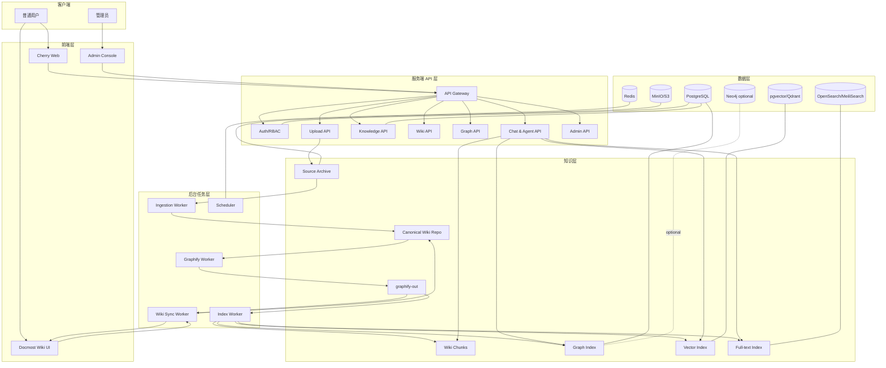
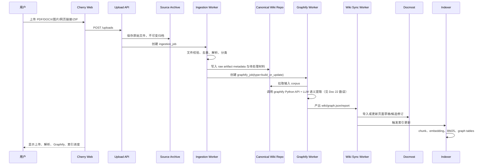
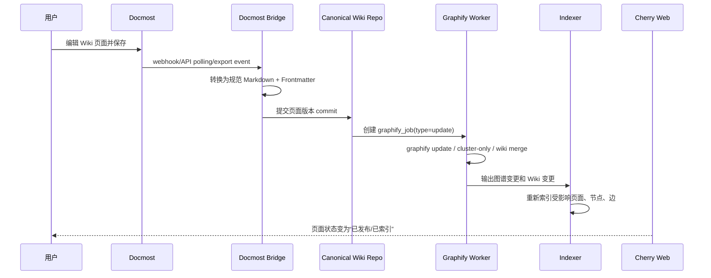
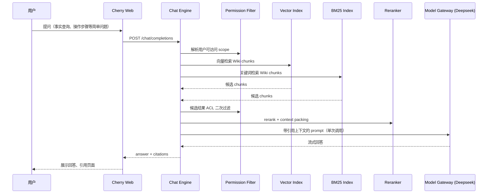
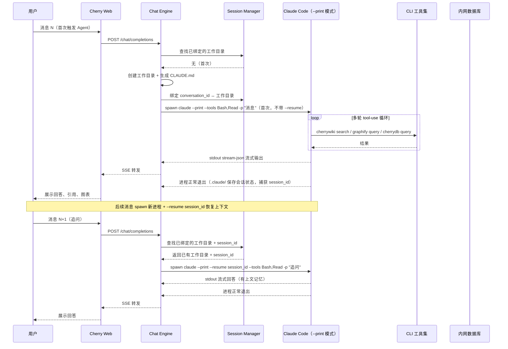

# 02. 总体架构设计

## 1. 架构目标

本架构需要同时满足：

1. Cherry Studio Web 化：从桌面单用户客户端转为多用户服务端平台。
2. Graphify 平台化：从 CLI/Agent Skill 转为后台任务和知识索引器。
3. Graphify Wiki 唯一知识源：所有问答依据均来自发布后的 Wiki 页面和其派生索引。
4. Docmost 协作编辑：提供 Wiki 页面浏览、编辑、权限、页面历史和附件体验。
5. 强耦合 GraphRAG：Graphify 图谱不仅作为工具，还直接进入检索、UI、Agent 和权限链路。
6. Docker 化部署：所有模块可容器化，支持开发、测试、生产环境隔离。

## 2. 总体服务拆分

```text
apps/
  web/                    Cherry Web 用户前端
  admin/                  管理后台前端，可与 web 合并
  api/                    Cherry Web 后端 API
  graphify-worker/        Graphify 任务 Worker
  ingestion-worker/       上传资料解析和归档 Worker
  wiki-sync-worker/       Docmost ↔ Canonical Wiki Repo 同步 Worker
  indexer-worker/         Wiki、chunk、embedding、graph 索引 Worker
  mcp-gateway/            MCP 工具聚合网关，可选

external-or-forked/
  docmost/                Docmost Shell，可直接部署或二开 Fork

packages/
  ai-core/                模型调用、流式输出、工具调用
  auth-core/              用户、角色、权限、ACL
  graph-core/             graph.json 解析、图查询、路径查询
  wiki-core/              Wiki 页面模型、Frontmatter、差异合并
  rag-core/               Vector/BM25/GraphRAG 检索与上下文组装
  job-core/               任务状态机、重试、锁、幂等
  shared/                 类型、DTO、错误码、常量
```

## 3. 逻辑架构



## 4. 数据流一：上传资料自动归档、解析、生成 Wiki



## 5. 数据流二：人工修订 Wiki 后同步 Graphify



## 6. 数据流三：聊天（双层查询架构）

> 架构决策详见 [Doc 23 Agent 架构与 CLI 工具设计](../design/23_Agent架构与CLI工具设计.md)。

### 6.1 快速路径：静态 RAG（Phase 1，大部分查询）



### 6.2 深度路径：Claude Code Agent（Phase 3+，复杂查询 / 数据库 / 图谱推理）

Claude Code 进程与 Cherry 会话绑定（懒加载，首次触发时 spawn，后续消息复用）。详见 Doc 23 §2.1。



### 6.3 路由规则

| 条件 | 走快速路径（静态 RAG） | 走深度路径（Claude Code Agent） |
|---|---|---|
| 意图为 `fact_lookup` / `how_to` | 是 | — |
| 意图为 `relationship_explanation` / `architecture_reasoning` | — | 是 |
| 用户开启"数据库"开关 | — | 是 |
| 用户开启"深度分析"开关 | — | 是 |
| retrieval_mode 为 `graph_rag` / `path_first` / `community_first` | — | 是 |
| 当前会话已绑定 Agent 工作目录 | — | 是（直接 `--resume <session_id>` 复用） |
| 静态 RAG 返回 `no_hit` 且 `strict_knowledge_only = false` | — | 可降级触发 |

### 6.4 CLI 工具族

```text
graphify query/path/explain     ← 图谱知识检索（graphify 项目已有）
cherrydb tables/query/chart     ← 内网数据库查询与图表（新建）
cherrywiki search/page          ← Wiki 全文检索（新建，包装 Vector + BM25）
```

Claude Code 通过 Bash 调用这些 CLI 工具，天然支持多轮纠错。CLAUDE.md 注入规则控制检索优先级和回答约束。详见 Doc 23。

## 7. 存储分层

| 层级 | 存储 | 说明 |
|---|---|---|
| 原始归档 | MinIO/S3/本地卷 | 上传原文件、网页快照、解析产物、Graphify 输出。 |
| 规范 Wiki | Git repo + PostgreSQL metadata | Graphify Wiki Markdown 页面，唯一知识源。 |
| Docmost 页面 | Docmost PostgreSQL | 用户可视化编辑 UI，需通过 Bridge 与规范 Wiki 同步。 |
| 关系数据库 | PostgreSQL | 用户、权限、任务、页面版本、图节点边、审计。 |
| 缓存/队列 | Redis | 任务队列、分布式锁、临时状态、SSE fanout。 |
| 向量索引 | pgvector 或 Qdrant | Wiki chunk embedding。Phase 1 使用 pgvector，后续可切换 Qdrant。 |
| 关键词索引 | PostgreSQL FTS 或 OpenSearch | Phase 1 使用 PostgreSQL FTS，规模扩大后使用 OpenSearch/MeiliSearch。 |
| 图谱索引 | PostgreSQL graph tables，Neo4j 可选 | Phase 1-3 使用 PostgreSQL 图谱表存节点、边和路径；复杂图查询成熟后再引入 Neo4j。 |

## 8. 关键设计约束

### 8.1 禁止直接把 Graphify 全量 JSON 塞进 Prompt

Graphify 官方建议从 `GRAPH_REPORT.md` 获得高层概览，再通过 `graphify query` 等 CLI 命令获取聚焦子图。平台遵循同一原则：快速路径通过静态索引注入必要片段；深度路径通过 Claude Code Agent 调用 `graphify query/path/explain` CLI 进行多轮图遍历。

### 8.2 Graphify 运行必须任务化

Graphify 可能耗时较长，必须通过任务队列执行：

```text
pending → preparing → running → parsing_output → indexing → syncing_docmost → completed
                                      ↓
                                    failed
```

每一步都要可重试、可审计、可回滚。

### 8.3 Docmost Bridge 不能成为黑盒

本项目已确定采用 Docmost 开源版 Fork + 自建 Bridge endpoint。Docmost Bridge 是一等集成面，不再保留企业版 API/MCP 作为主路径；除故障排查外，平台禁止长期依赖直接读写 Docmost 数据库。

### 8.4 生成内容和人工内容分层

自动生成内容必须可识别、可回滚、可审核。页面的 Frontmatter 和块级标记是强制规范。

## 9. 推荐组件组合

### Phase 1

```text
Frontend:       React + TypeScript + Vite
Backend:        Node.js + Fastify/NestJS
Worker:         Python + Graphify Python API + OpenAI-compatible LLM（见 Doc 22 勘误）
DB:             PostgreSQL 16+
Cache/Queue:    Redis 7/8
Object Store:   MinIO
Vector:         pgvector
Search:         PostgreSQL FTS，后续 OpenSearch
Chat LLM:      Deepseek Flash（静态 RAG 路径，低成本）
Wiki UI:        Cherry Web 内置只读 Wiki（Phase 2 接入 Docmost Fork）
Deployment:     Docker Compose，后续 Kubernetes
```

### Phase 3+ 新增

```text
Agent Runtime:  Claude Code CLI（复用现有 agent loop，不自建）
Agent LLM:      Anthropic Claude（Claude Code 绑定，用于深度路径）
CLI 工具:       graphify query/path/explain（已有）+ cherrydb（新建）+ cherrywiki（新建）
数据库接入:     cherrydb CLI → 内网只读数据库连接
图表渲染:       ECharts JSON（Agent 输出）→ 前端 ECharts 组件
```

> Agent 架构决策详见 [Doc 23](../design/23_Agent架构与CLI工具设计.md)。

## 10. 可扩展点

1. `graph-core` 支持从 `graph.json` 导入 PostgreSQL，也支持推送 Neo4j。
2. `mcp-gateway` 支持 Graphify MCP、Docmost MCP、第三方工具统一接入。
3. `model-gateway` 支持 OpenAI、Anthropic、Gemini、本地模型和代理网关。
4. `wiki-core` 支持其他 Wiki UI 替换，例如 Wiki.js，但不改变 Graphify Wiki 唯一源原则。

## 11. Cherry Studio 改造策略

> 本节合并 TODO T-1.2.1 / T-5.5.1。代码审计细节见 [`20_Cherry_Studio_代码审计.md`](../audit/20_Cherry_Studio_代码审计.md)。

### 11.1 改造原则

1. **不做 Electron 原样搬迁**：删除 Electron Main/Preload/IPC 运行假设，保留可复用 UI、类型、模型抽象和业务组件。
2. **前后端职责重分配**：Renderer 中的本地数据库、本地文件系统、系统弹窗、shell、MCP 子进程管理等能力统一迁移到后端 API/Worker。
3. **共享包先于页面迁移**：优先抽取 `packages/shared`、`packages/aiCore`、Markdown/渲染组件，再迁移页面。
4. **保留 Cherry 体验，不复制桌面架构**：Chat、模型选择、Markdown 渲染、助手配置、知识库入口和 MCP 配置保留交互习惯；存储、权限、任务、审计重做。

### 11.2 可复用模块路径映射

| 原路径 | CherryGraph 新路径 | 复用等级 | 处理方式 |
|---|---|---:|---|
| `src/renderer/src/components/**` | `apps/web/src/components/cherry/**` | A/B | 与 Electron API 解耦后复用。 |
| `src/renderer/src/pages/**` | `apps/web/src/features/**` | B/C | Chat、设置、知识库页按业务拆分迁移。 |
| `src/renderer/src/store/**` | `apps/web/src/store/**` | B | 保留状态切片思想，移除本地持久化和 IPC 调用。 |
| `src/renderer/src/services/**` | `apps/web/src/services/**` + `apps/api/src/services/**` | B/C | 浏览器侧只保留 HTTP/SSE client；业务执行迁到 API。 |
| `packages/aiCore/**` | `packages/ai-core/**` | A/B | 作为后端模型调用核心；浏览器端不直接持有 provider key。 |
| `packages/shared/**` | `packages/shared/**` | A/B | 类型、工具、常量复用；`IpcChannel.ts` 改为 API event 定义。 |
| `packages/mcp-trace/**` | `packages/mcp-trace/**` + `apps/mcp-gateway/**` | B | trace-core/trace-web 可复用，trace-node 与 Gateway 绑定。 |
| `src/main/**` | `apps/api/**` / `apps/*-worker/**` | C | Electron 主进程逻辑不直接复用，仅作为业务行为参考。 |
| `src/preload/**` | 删除或替换为 `packages/api-client` | C | Preload bridge 在 Web 端不存在。 |

### 11.3 需重写模块清单

| 模块 | 重写原因 | 新实现 |
|---|---|---|
| 本地文件选择、文件读取、目录导入 | Web 无本地 `fs/dialog` 权限，且需统一归档审计。 | `Upload API` + `Source Archive` + `Ingestion Worker`。 |
| 本地数据库和用户设置 | 多用户平台不能使用单机本地状态作为权威。 | PostgreSQL + Redis + per-user setting API。 |
| Electron IPC 调用 | Web 端无法使用 `ipcRenderer`。 | HTTP REST + SSE + WebSocket event bus。 |
| MCP 子进程管理 | 多用户共享服务端需集中管理工具权限、进程和审计。 | `mcp-gateway` + per-space tool policy。 |
| 知识库本地向量化 | 本项目只检索 Graphify Wiki，且索引是服务端任务。 | `indexer-worker` + pgvector/Qdrant + BM25。 |
| WebDAV/本地备份 | 与当前 Phase 目标无关且存在权限边界问题。 | Phase 4 后按备份恢复模块单独实现。 |

### 11.4 Electron → Web 适配层

| Electron 能力 | Web 替代 | 约束 |
|---|---|---|
| `ipcRenderer.invoke(channel, payload)` | `apiClient.request(method, path, payload)` | 所有接口必须有 OpenAPI 定义。 |
| `ipcRenderer.on(channel)` | `EventSource` / WebSocket | 用于任务进度、Chat 流式输出和通知。 |
| `fs.readFile` / `path` | Upload API / Object Storage | 浏览器不读取服务器文件路径。 |
| `dialog.showOpenDialog` | `<input type="file">` / 拖拽上传 | 目录上传走 webkitdirectory 或 ZIP。 |
| `shell.openExternal` | 前端路由或安全跳转服务 | 外链需做 allowlist 和审计。 |
| `BrowserWindow` / mini window | Web route / modal / side panel | 桌面窗口能力不迁移。 |
| 本地配置文件 | 用户设置 API | 敏感配置只保存在服务端。 |

### 11.5 前端状态管理迁移

1. 全局 UI 状态使用 `zustand` 或等价轻量 store。
2. 服务端数据使用 `TanStack Query` 管理缓存、失效和乐观更新。
3. Chat 流式消息使用独立 event store，避免与查询缓存耦合。
4. 管理后台表格使用标准 query/pagination/filter 模型。
5. 任何可审计业务状态不得只存在浏览器 store，必须由 API 确认。

### 11.6 `packages/graph-core` Repository 抽象

Phase 1-3 使用 PostgreSQL 图表，Phase 4+ 视性能再切 Neo4j。接口如下：

```ts
export interface GraphRepository {
  getNode(input: { tenantId: string; spaceId: string; nodeId: string }): Promise<GraphNode | null>
  getNeighbors(input: { tenantId: string; spaceId: string; nodeId: string; maxHops?: number }): Promise<GraphSubgraph>
  shortestPath(input: { tenantId: string; spaceId: string; source: string; target: string; maxHops: number }): Promise<GraphPath[]>
  querySubgraph(input: { tenantId: string; spaceIds: string[]; query: string; limit: number }): Promise<GraphSubgraph>
  importGraphJson(input: { tenantId: string; spaceId: string; graphifyRunId: string; graphJsonUri: string }): Promise<ImportResult>
}
```

| 实现 | 使用阶段 | 说明 |
|---|---|---|
| `PgGraphRepository` | Phase 1-3 | 使用 `graph_nodes`、`graph_edges`、`graph_communities` 表实现。 |
| `Neo4jGraphRepository` | Phase 4+ 预留 | 复杂路径、社区和跨库图查询压力增大后启用。 |
| `GraphifyJsonRepository` | 调试/回放 | 直接读取 `graph.json`，只用于测试和 schema 兼容验证。 |

### 11.7 改造量估算口径

精确行数由本地审计脚本输出。方案层采用以下口径：

| 类型 | 估算口径 | 当前策略 |
|---|---|---|
| A 类直接复用 | 与 Electron API 无关的纯 UI、类型、工具、Markdown 渲染 | 优先迁移。 |
| B 类适配复用 | 页面组件、store、services、aiCore、mcp-trace | 抽掉 IPC/本地存储后迁移。 |
| C 类重写 | main/preload、本地 DB、本地文件、MCP 进程、知识库本地索引 | 按 Web/API/Worker 重建。 |
