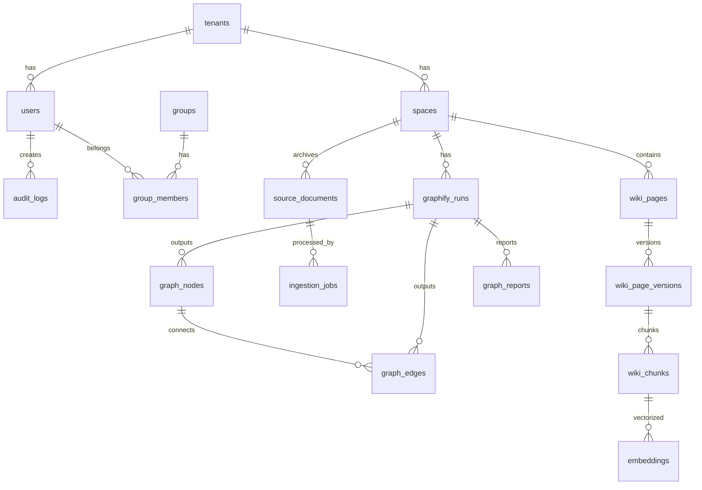

# 10. 数据模型与数据库设计

## 1. 设计原则

1. 多租户字段 `tenant_id` 必须存在于核心业务表。
2. Space 是权限和知识隔离的基本单位。
3. Wiki Page 是唯一可检索知识源。
4. 每个可检索对象必须绑定 `page_id`、`page_version` 和 ACL。
5. Graphify 运行结果必须版本化。
6. 原始上传文件只作为 Source Archive，不直接进入检索。

## 2. 核心实体



## 3. 表设计摘要

### 3.1 `spaces`

代表知识权限域。

关键字段：

- `id`
- `tenant_id`
- `name`
- `slug`
- `docmost_space_id`
- `wiki_repo_path`
- `default_publish_policy`
- `graphify_config`
- `created_at`

### 3.2 `wiki_pages`

页面逻辑主表。

关键字段：

- `id`
- `tenant_id`
- `space_id`
- `page_id`
- `title`
- `slug`
- `status`
- `current_version_id`
- `docmost_page_id`
- `created_by`
- `updated_at`

### 3.3 `wiki_page_versions`

页面版本表。

关键字段：

- `id`
- `page_id`
- `version_no`
- `content_markdown`
- `frontmatter_json`
- `source`：graphify/docmost/manual_merge
- `graphify_run_id`
- `commit_hash`
- `status`
- `created_by`
- `created_at`

### 3.4 `source_documents`

原始资料归档表。

关键字段：

- `id`
- `tenant_id`
- `space_id`
- `sha256`
- `filename`
- `mime_type`
- `storage_uri`
- `parsed_uri`
- `status`
- `uploader_id`
- `metadata_json`

### 3.5 `graphify_runs`

Graphify 运行记录。

关键字段：

- `id`
- `tenant_id`
- `space_id`
- `trigger_type`
- `mode`
- `status`
- `input_version`
- `output_version`
- `graph_json_uri`
- `wiki_output_uri`
- `report_uri`
- `started_at`
- `completed_at`
- `error_json`

### 3.6 `graph_nodes`

图谱节点。

关键字段：

- `id`
- `tenant_id`
- `space_id`
- `graphify_run_id`
- `node_key`
- `label`
- `type`
- `community_id`
- `page_id`
- `page_version_id`
- `source_refs_json`
- `acl_json`

### 3.7 `graph_edges`

图谱关系。

关键字段：

- `id`
- `tenant_id`
- `space_id`
- `graphify_run_id`
- `source_node_id`
- `target_node_id`
- `relation_type`
- `confidence_label`
- `confidence_score`
- `evidence_refs_json`
- `acl_json`

### 3.8 `wiki_chunks`

页面切片。

关键字段：

- `id`
- `tenant_id`
- `space_id`
- `page_id`
- `page_version_id`
- `section_id`
- `chunk_index`
- `content`
- `token_count`
- `acl_json`

### 3.9 `embeddings`

Embedding 表。Phase 1 可用 pgvector。

关键字段：

- `id`
- `chunk_id`
- `model_id`
- `embedding`
- `created_at`

## 4. ACL Envelope

可检索对象统一 ACL：

```json
{
  "tenant_id": "tenant_001",
  "space_id": "space_rd",
  "allowed_group_ids": ["group_rd", "group_arch"],
  "classification": "internal",
  "page_id": "rd.auth.sso",
  "page_version": 12
}
```

所有索引对象必须保存 ACL 快照，避免检索时跨表查询过重。

## 5. 索引策略

### 5.1 唯一索引

- `wiki_pages(tenant_id, space_id, page_id)`
- `source_documents(tenant_id, sha256)`
- `graph_nodes(tenant_id, space_id, graphify_run_id, node_key)`

### 5.2 检索索引

- `wiki_chunks`：全文索引。
- `embeddings`：vector index。
- `graph_nodes(label)`：trigram 或全文。
- `graph_edges(source_node_id, target_node_id)`。
- `audit_logs(tenant_id, created_at)`。

## 6. 版本一致性

### 6.1 index_snapshots 统一快照

Chat 检索不再分散判断 page_version、chunk status、graphify_run，而是通过 `index_snapshots` 表统一管理：

```text
spaces.active_index_snapshot_id → index_snapshots.id
  绑定: graphify_run_id, wiki_repo_commit_hash, embedding_model_id
  关联: wiki_chunks.index_snapshot_id = spaces.active_index_snapshot_id
        graph_nodes.graphify_run_id = index_snapshots.graphify_run_id
```

Chat 检索约束简化为：

```sql
SELECT c.* FROM wiki_chunks c
JOIN spaces s ON c.space_id = s.id
WHERE c.index_snapshot_id = s.active_index_snapshot_id
  AND c.index_status = 'indexed'
```

### 6.2 快照生命周期

```text
building → ready → activated → superseded
```

- `building`：indexer-worker 正在写入 chunk 和 embedding
- `ready`：所有 chunk 已索引，待激活
- `activated`：写入 `spaces.active_index_snapshot_id`，Chat 开始使用
- `superseded`：被新快照替代，旧 chunk 可按保留策略清理

### 6.3 Fallback

如果当前快照构建失败或不存在，Chat 使用 `spaces.active_index_snapshot_id` 指向的上一个成功快照。不会因索引正在构建而阻断问答。

## 7. 数据保留策略

| 数据 | 保留策略 |
|---|---|
| 页面版本 | 默认永久，支持管理员清理旧版本。 |
| Source Archive | 默认永久，受合规策略控制。 |
| Graphify 输出 | 保留最近 N 次完整输出，旧输出归档。 |
| Embedding | 页面版本废弃后可清理。 |
| Chat 消息 | 按组织策略。 |
| 审计日志 | 至少 180 天，建议 1 年以上。 |

## 8. SQL 草案

完整草案见 [`../schemas/schema.sql`](../schemas/schema.sql)。

## 9. Phase 1 验收

1. 表结构支持 Space 隔离。
2. Wiki 页面支持版本化。
3. Source Document 只作为归档。
4. Graphify Run 可追踪输出。
5. 节点、边、chunk 都可绑定页面版本和 ACL。
6. Chat 检索不会返回未发布或无权限对象。

## 8. 版本一致性补充

> 本节合并 TODO T-5.1.2 / T-7.1。

### 8.1 `spaces` 新增字段

| 字段 | 类型 | 说明 |
|---|---|---|
| `index_consistency_status` | text | `healthy / checking / inconsistent`，由一致性检查任务写入。 |
| `active_graphify_run_id` | text | 当前 Space 最近一次成功或活跃 Graphify run。 |
| `active_index_snapshot_id` | text | 当前 Chat 使用的索引快照。指向 `index_snapshots.id`。 |

### 8.2 `wiki_pages` 新增字段

| 字段 | 类型 | 说明 |
|---|---|---|
| `indexed_version_id` | text | 最近一次成功索引的页面版本。Chat 默认读取该版本。 |
| `sync_status` | text | `synced / sync_pending / conflict_required / failed`。 |

### 8.3 版本锁索引

```sql
CREATE INDEX idx_wiki_pages_indexed_version ON wiki_pages(indexed_version_id);
CREATE INDEX idx_wiki_pages_current_indexed ON wiki_pages(current_version_id, indexed_version_id);
CREATE INDEX idx_spaces_consistency ON spaces(index_consistency_status);
CREATE INDEX idx_wiki_versions_status ON wiki_page_versions(tenant_id, space_id, status, created_at DESC);
```

### 8.4 tenant_id 约束

所有核心业务表必须具备 `tenant_id`：

- 用户、组、Space、权限。
- Wiki 页面、版本、chunk、embedding 关联对象。
- Source Archive、jobs、graphify_runs。
- graph_nodes、graph_edges、graph_communities、graph_reports。
- chat、audit、feedback、proposals。

即使当前是内部小团队单 tenant，也保留该字段以便权限隔离、审计和未来扩展。

## 9. GraphRAG 扩展表建议

TODO 之外建议增加以下表，便于 Phase 3-4：

| 表 | 阶段 | 用途 |
|---|---|---|
| `index_snapshots` | Phase 1 | 统一索引快照，绑定 graphify_run、commit_hash、embedding_model。 |
| `graph_communities` | Phase 3 | 存储 Graphify 社区、摘要、god node 关联。 |
| `wiki_update_proposals` | Phase 2 | 存储 Graphify 候选更新和人工审核状态。 |
| `consistency_checks` | Phase 2 | 记录每次一致性检查结果。 |
| `retrieval_traces` | Phase 3 | 记录 GraphRAG 检索候选、rerank、引用链。 |
| `feedback_items` | Phase 4 | 用户反馈与知识治理闭环。 |
