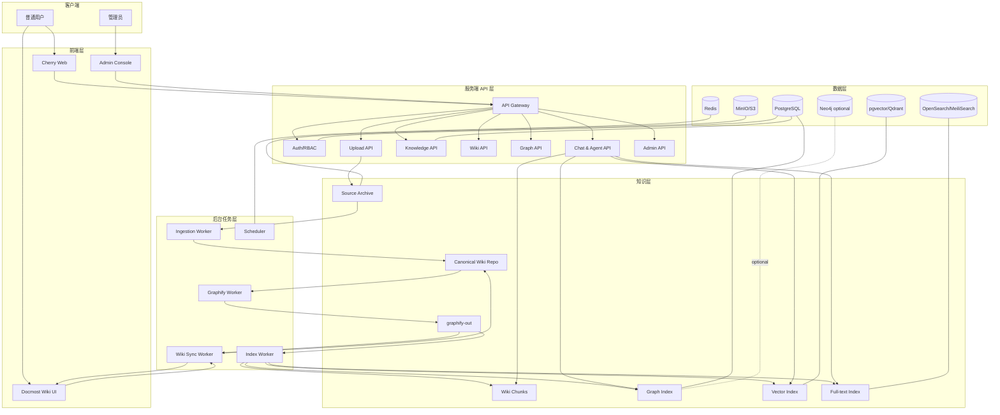
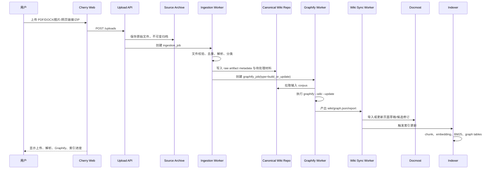
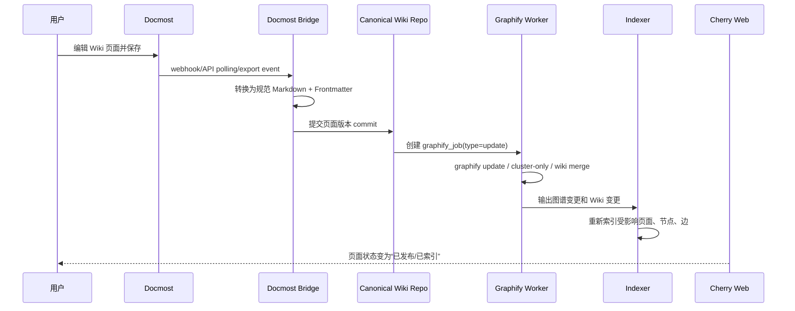
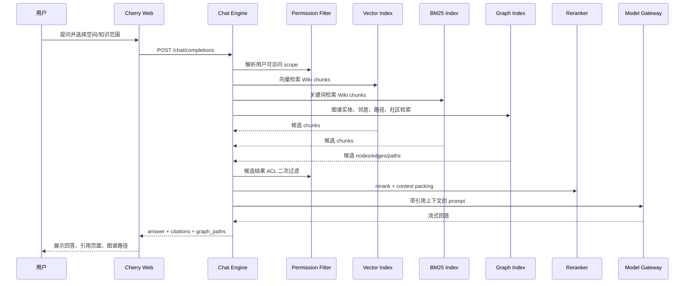

# 02. 总体架构设计

## 1. 架构目标

本架构需要同时满足：

1. Cherry Studio Web 化：从桌面单用户客户端转为多用户服务端平台。
2. Graphify 平台化：从 CLI/Agent Skill 转为后台任务和知识索引器。
3. Graphify Wiki 唯一知识源：所有问答依据均来自发布后的 Wiki 页面和其派生索引。
4. Docmost 协作编辑：提供 Wiki 页面浏览、编辑、权限、页面历史和附件体验。
5. 强耦合 GraphRAG：Graphify 图谱不仅作为工具，还直接进入检索、UI、Agent 和权限链路。
6. Docker 化部署：所有模块可容器化，支持开发、测试、生产环境隔离。

## 2. 总体服务拆分

```text
apps/
  web/                    Cherry Web 用户前端
  admin/                  管理后台前端，可与 web 合并
  api/                    Cherry Web 后端 API
  graphify-worker/        Graphify 任务 Worker
  ingestion-worker/       上传资料解析和归档 Worker
  wiki-sync-worker/       Docmost ↔ Canonical Wiki Repo 同步 Worker
  indexer-worker/         Wiki、chunk、embedding、graph 索引 Worker
  mcp-gateway/            MCP 工具聚合网关，可选

external-or-forked/
  docmost/                Docmost Shell，可直接部署或二开 Fork

packages/
  ai-core/                模型调用、流式输出、工具调用
  auth-core/              用户、角色、权限、ACL
  graph-core/             graph.json 解析、图查询、路径查询
  wiki-core/              Wiki 页面模型、Frontmatter、差异合并
  rag-core/               Vector/BM25/GraphRAG 检索与上下文组装
  job-core/               任务状态机、重试、锁、幂等
  shared/                 类型、DTO、错误码、常量
```

## 3. 逻辑架构



## 4. 数据流一：上传资料自动归档、解析、生成 Wiki



## 5. 数据流二：人工修订 Wiki 后同步 Graphify



## 6. 数据流三：聊天 GraphRAG



## 7. 存储分层

| 层级 | 存储 | 说明 |
|---|---|---|
| 原始归档 | MinIO/S3/本地卷 | 上传原文件、网页快照、解析产物、Graphify 输出。 |
| 规范 Wiki | Git repo + PostgreSQL metadata | Graphify Wiki Markdown 页面，唯一知识源。 |
| Docmost 页面 | Docmost PostgreSQL | 用户可视化编辑 UI，需通过 Bridge 与规范 Wiki 同步。 |
| 关系数据库 | PostgreSQL | 用户、权限、任务、页面版本、图节点边、审计。 |
| 缓存/队列 | Redis | 任务队列、分布式锁、临时状态、SSE fanout。 |
| 向量索引 | pgvector 或 Qdrant | Wiki chunk embedding。MVP 可用 pgvector。 |
| 关键词索引 | PostgreSQL FTS 或 OpenSearch | MVP 可用 PostgreSQL FTS，规模扩大后使用 OpenSearch/MeiliSearch。 |
| 图谱索引 | PostgreSQL graph tables，Neo4j 可选 | MVP 用表存节点边路径；复杂图查询再引入 Neo4j。 |

## 8. 关键设计约束

### 8.1 禁止直接把 Graphify 全量 JSON 塞进 Prompt

Graphify 官方建议从 `GRAPH_REPORT.md` 获得高层概览，再通过 `graphify query` 等方式获取聚焦子图。平台实现也应遵循这个原则：聊天时只注入必要节点、边、路径和相关页面片段。

### 8.2 Graphify 运行必须任务化

Graphify 可能耗时较长，必须通过任务队列执行：

```text
pending → preparing → running → parsing_output → indexing → syncing_docmost → completed
                                      ↓
                                    failed
```

每一步都要可重试、可审计、可回滚。

### 8.3 Docmost Bridge 不能成为黑盒

如果购买 Docmost Enterprise，可以优先使用其 REST API/MCP；如果只用开源版，则建议 Fork Docmost 或在服务端增加内部同步接口。不要长期依赖直接读写 Docmost 数据库。

### 8.4 生成内容和人工内容分层

自动生成内容必须可识别、可回滚、可审核。页面的 Frontmatter 和块级标记是强制规范。

## 9. 推荐 MVP 组件组合

```text
Frontend:       React + TypeScript + Vite
Backend:        Node.js + Fastify/NestJS
Worker:         Python + Graphify CLI/library wrapper
DB:             PostgreSQL 16+
Cache/Queue:    Redis 7/8
Object Store:   MinIO
Vector:         pgvector
Search:         PostgreSQL FTS，后续 OpenSearch
Wiki UI:        Docmost
Deployment:     Docker Compose，后续 Kubernetes
```

## 10. 可扩展点

1. `graph-core` 支持从 `graph.json` 导入 PostgreSQL，也支持推送 Neo4j。
2. `mcp-gateway` 支持 Graphify MCP、Docmost MCP、第三方工具统一接入。
3. `model-gateway` 支持 OpenAI、Anthropic、Gemini、本地模型和代理网关。
4. `wiki-core` 支持其他 Wiki UI 替换，例如 Wiki.js，但不改变 Graphify Wiki 唯一源原则。
