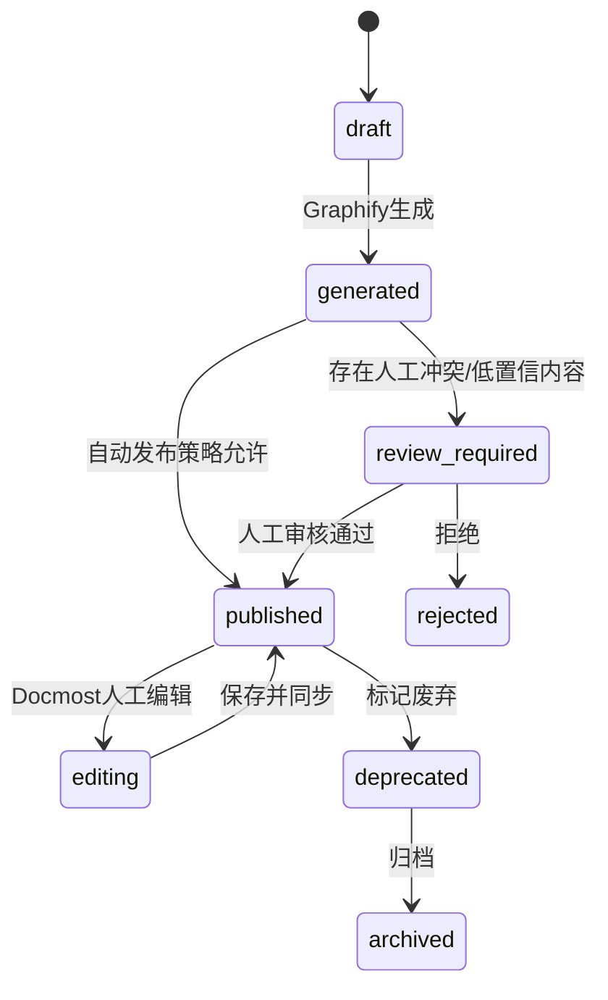

# 05. 模块需求：Graphify Wiki 唯一知识源

## 1. 模块定位

Graphify Wiki 是本项目唯一知识源。它既不是传统静态文档站，也不是 Docmost 原生页面集合，而是一套由 Graphify 生成、人工可修订、可版本化、可索引、可追溯的 Wiki 体系。

核心原则：

```text
AI 回答依据 = Published Graphify Wiki + 从 Wiki 派生的 graph/chunk/index
上传原文件 = 证据归档，不直接作为问答源
Docmost 页面 = Graphify Wiki 的编辑和展示壳层，不是独立知识源
```

## 2. 主要职责

1. 管理 Canonical Wiki Repo。
2. 规范 Wiki 页面 Frontmatter、section id、引用、来源。
3. 接收 Graphify `--wiki` 输出。
4. 接收 Docmost 人工修订输出。
5. 执行差异合并和冲突治理。
6. 驱动 Graphify 增量更新。
7. 生成可索引的 Published Wiki。
8. 为 Chat 提供可引用的页面版本。

## 3. Canonical Wiki Repo

### 3.1 目录结构

```text
wiki-repo/
  spaces/
    rd-platform/
      index.md
      pages/
        auth/
          sso.md
          oauth2.md
        architecture/
          service-mesh.md
      communities/
        community-001.md
      god-nodes/
        oauth2.md
      _attachments/
      _metadata/
        pages.jsonl
        source_map.jsonl
        graphify_runs.jsonl
    legal/
      ...
  global/
    taxonomy.md
    glossary.md
  .graphifyignore
```

### 3.2 页面命名规则

- 文件名使用 kebab-case。
- 页面 ID 使用 `space.slug.path`，例如 `rd-platform.auth.sso`。
- 页面标题允许中文。
- 每个页面必须有稳定 `page_id`。
- 不允许仅靠文件路径作为主键。

### 3.3 Frontmatter 规范

```yaml
---
page_id: rd-platform.auth.sso
title: 统一认证与 SSO
space_id: rd-platform
status: published
curation_status: human_verified
created_by: graphify
last_editor: user_123
created_at: 2026-04-27T09:00:00Z
updated_at: 2026-04-27T10:00:00Z
last_graphify_run_id: gf_20260427_001
source_document_ids:
  - src_001
  - src_002
graph_node_ids:
  - node_sso
  - node_oauth2
version: 12
acl_hash: acl_abc123
---
```

### 3.4 正文区块规范

为了避免 Graphify 覆盖人工内容，页面必须支持区块级所有权：

```markdown
<!-- graphify:managed:start id="summary" -->
本节由 Graphify 生成，可自动更新。
<!-- graphify:managed:end -->

<!-- human:curated:start id="implementation-notes" -->
本节由人工维护，Graphify 不得覆盖。
<!-- human:curated:end -->

<!-- graphify:proposal:start id="new-findings" run="gf_20260427_002" -->
本节是 Graphify 新提案，待人工接受。
<!-- graphify:proposal:end -->
```

## 4. 页面状态机



## 5. Graphify 输出处理

Graphify 运行输出通常包括：

```text
 graphify-out/
   graph.html
   GRAPH_REPORT.md
   graph.json
   wiki/
   cache/
```

处理规则：

1. `graph.json` 导入 graph tables。
2. `GRAPH_REPORT.md` 存为运行报告，并可生成 Space 级概览页。
3. `wiki/` 进入 `Graphify Wiki Merge Pipeline`。
4. `graph.html` 存入对象存储，可在管理后台预览。
5. `cache/` 可按策略保留，不作为知识源。

## 6. Graphify Wiki Merge Pipeline

### 6.1 输入

- 当前 Canonical Wiki Repo 版本。
- Graphify 新输出的 Wiki 页面。
- Docmost 最新人工修订。
- 页面区块所有权信息。
- 源文件和图谱变更。

### 6.2 输出

- 自动合并后的页面。
- 待审核候选更新。
- 冲突报告。
- 删除/合并建议。
- 索引更新清单。

### 6.3 合并规则

| 情况 | 处理 |
|---|---|
| 新页面 | 生成 draft，导入 Docmost。 |
| 仅 graphify managed 区块变化 | 自动更新，可直接发布或进入轻审核。 |
| human curated 区块被 Graphify 改写 | 禁止覆盖，生成 proposal。 |
| 页面标题变化 | 保留 page_id，标题作为候选更新。 |
| 页面被人工删除 | Graphify 不自动恢复，除非管理员确认。 |
| 重复页面 | 生成 merge proposal。 |
| 低置信关系 | 不进入正文事实区，进入“待确认关系”区。 |

## 7. 图谱关系可信度处理

Graphify 输出的关系应分层进入 Wiki 和问答：

| 关系类型 | 使用规则 |
|---|---|
| EXTRACTED | 可作为主要证据，进入正文和问答。 |
| INFERRED | 可作为推断辅助，回答中必须标注“推断”。 |
| AMBIGUOUS | 默认不进入最终回答，只进入审核队列或低置信提示。 |

## 8. 同步触发器

| 触发器 | 行为 |
|---|---|
| 上传资料成功解析 | 创建 Graphify build/update job。 |
| Docmost 页面保存 | 导出页面，回写 Repo，触发 Graphify update。 |
| 管理员手动重建 | 全量跑 Graphify。 |
| 定时任务 | 检查未索引页面和待更新文件。 |
| Git commit | 可选触发 Graphify hook。 |

## 9. Published Wiki

只有 Published Wiki 可进入 Chat 检索。发布条件：

1. 页面状态为 `published`。
2. 页面属于用户可访问 Space。
3. 页面不是 deprecated/archived。
4. 页面版本已经完成 chunk 和索引。
5. 页面 Frontmatter 完整。
6. 页面没有阻断级冲突。

## 10. MVP 功能清单

| 功能 | P0/P1 | 验收 |
|---|---|---|
| Canonical Wiki Repo | P0 | 每个 Space 有独立目录和页面元数据。 |
| Graphify 输出导入 | P0 | 可导入 wiki、graph.json、report。 |
| Docmost 页面同步 | P0 | 页面可导入 Docmost。 |
| 人工修订回写 | P0 | Docmost 编辑后回写 Repo。 |
| Published Wiki 索引 | P0 | Chat 只检索发布版本。 |
| 区块所有权 | P1 | Graphify 不覆盖人工区块。 |
| 候选更新审核 | P1 | 管理员可接受/拒绝。 |
| 关系置信分级 | P1 | 回答中标注推断/歧义。 |

## 11. 重要约束

1. 不允许 Chat 直接读取 Source Archive 作为上下文。
2. 不允许 Graphify 直接覆盖人工修订。
3. 不允许无 page_id 的页面进入索引。
4. 不允许无 ACL 的节点或边进入 GraphRAG。
5. 不允许把整份 `graph.json` 注入 Prompt。
