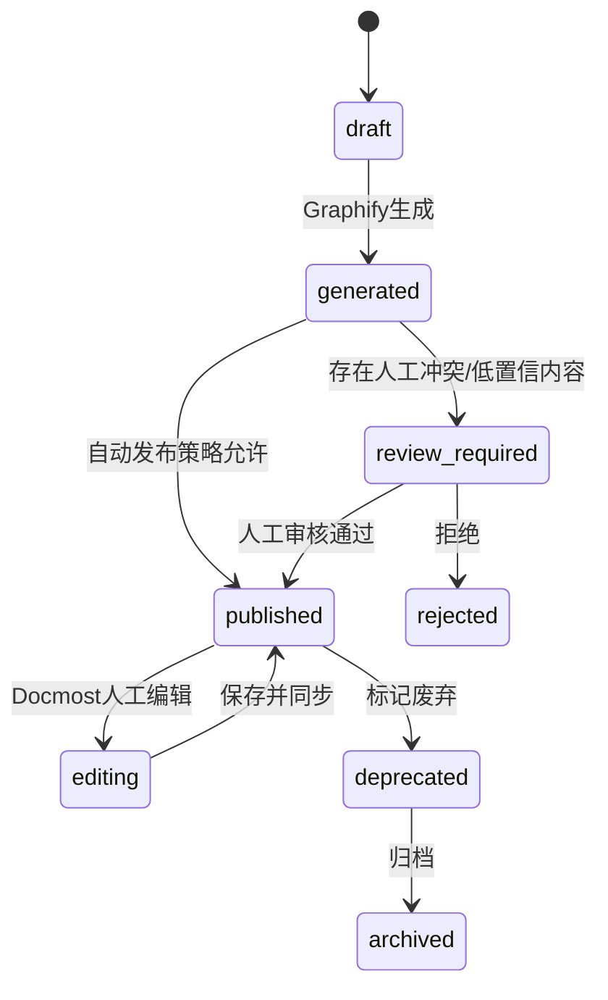

# 05. 模块需求：Graphify Wiki 唯一知识源

## 1. 模块定位

Graphify Wiki 是本项目唯一知识源。它既不是传统静态文档站，也不是 Docmost 原生页面集合，而是一套由 Graphify 生成、人工可修订、可版本化、可索引、可追溯的 Wiki 体系。

核心原则：

```text
AI 回答依据 = Published Graphify Wiki + 从 Wiki 派生的 graph/chunk/index
上传原文件 = 证据归档，不直接作为问答源
Docmost 页面 = Graphify Wiki 的编辑和展示壳层，不是独立知识源
```

## 2. 主要职责

1. 管理 Canonical Wiki Repo。
2. 规范 Wiki 页面 Frontmatter、section id、引用、来源。
3. 接收 Graphify `--wiki` 输出。
4. 接收 Docmost 人工修订输出。
5. 执行差异合并和冲突治理。
6. 驱动 Graphify 增量更新。
7. 生成可索引的 Published Wiki。
8. 为 Chat 提供可引用的页面版本。

## 3. Canonical Wiki Repo

### 3.1 目录结构

```text
wiki-repo/
  spaces/
    rd-platform/
      index.md
      pages/
        auth/
          sso.md
          oauth2.md
        architecture/
          service-mesh.md
      communities/
        community-001.md
      god-nodes/
        oauth2.md
      _attachments/
      _metadata/
        pages.jsonl
        source_map.jsonl
        graphify_runs.jsonl
    legal/
      ...
  global/
    taxonomy.md
    glossary.md
  .graphifyignore
```

### 3.2 页面命名规则

- 文件名使用 kebab-case。
- 页面 ID 使用 `space.slug.path`，例如 `rd-platform.auth.sso`。
- 页面标题允许中文。
- 每个页面必须有稳定 `page_id`。
- 不允许仅靠文件路径作为主键。

### 3.3 Frontmatter 规范

```yaml
---
page_id: rd-platform.auth.sso
title: 统一认证与 SSO
space_id: rd-platform
status: published
curation_status: human_verified
created_by: graphify
last_editor: user_123
created_at: 2026-04-27T09:00:00Z
updated_at: 2026-04-27T10:00:00Z
last_graphify_run_id: gf_20260427_001
source_document_ids:
  - src_001
  - src_002
graph_node_ids:
  - node_sso
  - node_oauth2
version: 12
acl_hash: acl_abc123
---
```

### 3.4 正文区块规范（双轨制）

为了避免 Graphify 覆盖人工内容，页面使用**双轨制**管理区块所有权。

**轨道 1：Markdown 内嵌标记**（用于 Git diff 可读性和直接编辑场景）：

```markdown
<!-- graphify:managed:start id="summary" -->
本节由 Graphify 生成，可自动更新。
<!-- graphify:managed:end -->

<!-- human:curated:start id="implementation-notes" -->
本节由人工维护，Graphify 不得覆盖。
<!-- human:curated:end -->

<!-- graphify:proposal:start id="new-findings" run="gf_20260427_002" -->
本节是 Graphify 新提案，待人工接受。
<!-- graphify:proposal:end -->
```

**轨道 2：`page_block_metadata` 表**（权威源，防止 Docmost 富文本编辑器清洗 HTML 注释）：

每个 block 在数据库中记录 `block_id`、`owner`（graphify / human）、`content_hash`、`graphify_run_id`、`last_editor`、`editable`。合并判断以 sidecar 为准，内嵌标记为辅助。

详细流程见 [Doc 21 §9.7](../design/21_Graphify_输出Schema契约.md)。

## 4. 页面状态机



## 5. Graphify Worker 执行协议

### 5.1 Job Payload

Python Worker 从 cherry-api Job API 拉取任务，payload 格式：

```json
{
  "run_id": "gf_001",
  "tenant_id": "tenant_001",
  "space_id": "space_rd",
  "input_repo_commit": "abc123",
  "graphify_ref": "7359cda",
  "mode": "build",
  "trigger_type": "manual",
  "input_scope": {
    "page_ids": ["rd.auth.sso"],
    "source_document_ids": ["src_001"]
  },
  "options": {
    "wiki": true,
    "no_viz": false,
    "directed": false
  },
  "timeout_seconds": 3600,
  "output_uri": "s3://cherry/graphify/gf_001/",
  "callback_url": "http://cherry-api:8080/internal/jobs/gf_001/complete"
}
```

| 字段 | 说明 |
|---|---|
| `run_id` | 全局唯一运行 ID |
| `input_repo_commit` | Canonical Wiki Repo 的 git commit SHA，确保输入可复现 |
| `graphify_ref` | Graphify CLI/library 的 pinned 版本（git ref），确保行为可复现 |
| `mode` | `build`（全量）/ `update`（增量）/ `rebuild`（全量 + 清除旧图） |
| `timeout_seconds` | Worker 超时上限（默认 3600s），超时自动标记 failed |
| `output_uri` | 输出上传目标（MinIO/S3 前缀） |
| `callback_url` | 完成时回调 cherry-api 的内部 URL |

### 5.2 状态机

```text
pending → preparing → running_graphify → parsing_output → importing_graph → indexing → syncing_docmost → completed
                                                                                                      ↘ quarantine
任意阶段 → failed
pending → cancelled
```

| 状态 | Worker 行为 |
|---|---|
| `pending` | 等待 Worker 拉取 |
| `preparing` | 拉取 Wiki Repo snapshot、校验输入 |
| `running_graphify` | 执行 Graphify CLI |
| `parsing_output` | 校验输出 schema（graph.json、wiki/、report） |
| `importing_graph` | 写入 graph_nodes / graph_edges / graph_communities |
| `indexing` | 生成 chunks、embeddings、构建新 index_snapshot |
| `syncing_docmost` | 同步 Wiki 页面到 Docmost（Phase 2 才激活） |
| `completed` | 全部成功，激活新 index_snapshot |
| `quarantine` | 输出校验失败，数据隔离不进入索引 |
| `failed` | 不可恢复错误 |
| `cancelled` | 用户/系统取消 |

### 5.3 并发与互斥规则

| 规则 | 实现 |
|---|---|
| **同一 Space 同一时间只允许一个 active run** | cherry-api 创建 run 前检查是否有 `status IN (pending, preparing, running_graphify, parsing_output, importing_graph, indexing, syncing_docmost)` 的 run；有则拒绝，返回 `GRAPHIFY_RUN_ALREADY_RUNNING` |
| **新 run 不覆盖 active graph** | importing_graph 写入新的 `graph_version_id`，不修改当前 `active_index_snapshot_id` 指向的数据 |
| **原子激活** | 只有 parse + import + index 全部成功，才 `UPDATE spaces SET active_index_snapshot_id = new_snapshot_id`。任何阶段失败，`active_index_snapshot_id` 保持不变，Chat 继续使用旧快照 |
| **Worker 独占锁** | Worker 拉取任务时 `SETNX graphify_lock:{space_id} {run_id} EX {timeout_seconds}`，执行完成或失败后释放。异常退出由 TTL 兜底 |

### 5.4 Quarantine 机制

当 Graphify 输出不符合 Schema 契约（见 Doc 21）时，进入 quarantine 而非直接 failed：

| 触发条件 | 处理 |
|---|---|
| `graph.json` 缺失或 JSON 解析失败 | → `failed`（无可用输出） |
| `graph.json` 存在但 schema 校验不通过（缺少必填字段、类型错误） | → `quarantine` |
| `wiki/` 页面数量为 0 且 mode=build | → `quarantine` |
| 节点数 / 边数异常偏离上次成功 run 超过 80% | → `quarantine`（防止误删） |
| 输出文件总大小超过 Space 配额 | → `quarantine` |

Quarantine 状态下：

1. 输出文件保留在 `output_uri`，不删除
2. 不执行 importing_graph / indexing / syncing_docmost
3. 管理员可在 Admin Console 查看 quarantine run 的输出和校验报告
4. 管理员可手动操作：`force_accept`（强制导入）或 `discard`（丢弃）
5. `active_index_snapshot_id` 不变，Chat 不受影响

### 5.5 超时与重试

| 场景 | 行为 |
|---|---|
| Worker 执行超过 `timeout_seconds` | Worker 自身 kill 子进程，标记 `failed`，释放锁 |
| Worker 进程崩溃（Redis lock TTL 到期） | cherry-api 定时扫描 `status=running_graphify AND updated_at < now() - timeout`，标记 `failed` |
| 可重试错误（网络超时、模型限流） | Worker 内部重试 3 次，间隔指数退避。3 次均失败则标记 `failed` |
| 管理员手动 retry | 创建新 run（`parent_run_id` 指向旧 run），使用相同 input 参数 |

### 5.6 输出上传契约

Worker 完成 Graphify CLI 后，按以下结构上传到 `output_uri`：

```text
s3://cherry/graphify/{run_id}/
  graph.json
  GRAPH_REPORT.md
  graph.html          (可选，no_viz=true 时无)
  wiki/
    index.md
    {slug}.md ...
  validation_report.json   (Worker 自检报告)
```

`validation_report.json` 包含：

```json
{
  "run_id": "gf_001",
  "schema_version": "1.0.0",
  "checks": {
    "graph_json_valid": true,
    "node_count": 45,
    "edge_count": 82,
    "wiki_page_count": 12,
    "report_exists": true,
    "total_size_bytes": 524288
  },
  "warnings": [],
  "errors": []
}
```

cherry-api 根据 `validation_report.json` 决定进入 `importing_graph` 还是 `quarantine`。

---

## 6. Graphify 输出处理

Graphify 运行输出通常包括：

```text
 graphify-out/
   graph.html
   GRAPH_REPORT.md
   graph.json
   wiki/
   cache/
```

处理规则：

1. `graph.json` 导入 graph tables。
2. `GRAPH_REPORT.md` 存为运行报告，并可生成 Space 级概览页。
3. `wiki/` 进入 `Graphify Wiki Merge Pipeline`。
4. `graph.html` 存入对象存储，可在管理后台预览。
5. `cache/` 可按策略保留，不作为知识源。

## 7. Graphify Wiki Merge Pipeline

### 6.1 输入

- 当前 Canonical Wiki Repo 版本。
- Graphify 新输出的 Wiki 页面。
- Docmost 最新人工修订。
- 页面区块所有权信息。
- 源文件和图谱变更。

### 6.2 输出

- 自动合并后的页面。
- 待审核候选更新。
- 冲突报告。
- 删除/合并建议。
- 索引更新清单。

### 6.3 合并规则

| 情况 | 处理 |
|---|---|
| 新页面 | 生成 draft，导入 Docmost。 |
| 仅 graphify managed 区块变化 | 自动更新，可直接发布或进入轻审核。 |
| human curated 区块被 Graphify 改写 | 禁止覆盖，生成 proposal。 |
| 页面标题变化 | 保留 page_id，标题作为候选更新。 |
| 页面被人工删除 | Graphify 不自动恢复，除非管理员确认。 |
| 重复页面 | 生成 merge proposal。 |
| 低置信关系 | 不进入正文事实区，进入“待确认关系”区。 |

## 8. 图谱关系可信度处理

Graphify 输出的关系应分层进入 Wiki 和问答：

| 关系类型 | 使用规则 |
|---|---|
| EXTRACTED | 可作为主要证据，进入正文和问答。 |
| INFERRED | 可作为推断辅助，回答中必须标注“推断”。 |
| AMBIGUOUS | 默认不进入最终回答，只进入审核队列或低置信提示。 |

## 9. 同步触发器

| 触发器 | 行为 |
|---|---|
| 上传资料成功解析 | 创建 Graphify build/update job。 |
| Docmost 页面保存 | 导出页面，回写 Repo，触发 Graphify update。 |
| 管理员手动重建 | 全量跑 Graphify。 |
| 定时任务 | 检查未索引页面和待更新文件。 |
| Git commit | 可选触发 Graphify hook。 |

## 10. Published Wiki

只有 Published Wiki 可进入 Chat 检索。发布条件：

1. 页面状态为 `published`。
2. 页面属于用户可访问 Space。
3. 页面不是 deprecated/archived。
4. 页面版本已经完成 chunk 和索引。
5. 页面 Frontmatter 完整。
6. 页面没有阻断级冲突。

## 11. Phase 1 功能清单

| 功能 | P0/P1 | 验收 |
|---|---|---|
| Canonical Wiki Repo | P0 | 每个 Space 有独立目录和页面元数据。 |
| Graphify 输出导入 | P0 | 可导入 wiki、graph.json、report。 |
| Docmost 页面同步 | P0 | 页面可导入 Docmost。 |
| 人工修订回写 | P0 | Docmost 编辑后回写 Repo。 |
| Published Wiki 索引 | P0 | Chat 只检索发布版本。 |
| 区块所有权 | P1 | Graphify 不覆盖人工区块。 |
| 候选更新审核 | P1 | 管理员可接受/拒绝。 |
| 关系置信分级 | P1 | 回答中标注推断/歧义。 |

## 12. 重要约束

1. 不允许 Chat 直接读取 Source Archive 作为上下文。
2. 不允许 Graphify 直接覆盖人工修订。
3. 不允许无 page_id 的页面进入索引。
4. 不允许无 ACL 的节点或边进入 GraphRAG。
5. 不允许把整份 `graph.json` 注入 Prompt。
