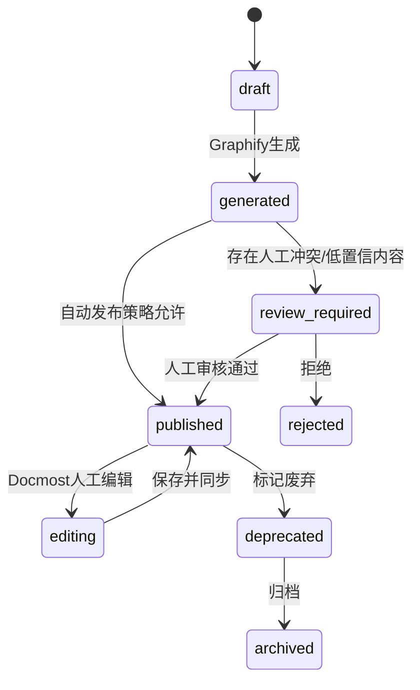

# 05. 模块需求：Graphify Wiki 唯一企业知识引用源

## 1. 模块定位

Graphify Wiki 是本项目**唯一企业知识引用源**。它既不是传统静态文档站，也不是 Docmost 原生页面集合，而是一套由 Graphify 生成、人工可修订、可版本化、可索引、可追溯的 Wiki 体系。

核心原则：

```text
企业知识引用源 = Published Graphify Wiki + 从 Wiki 派生的 graph/chunk/index
上传原文件 = 证据归档，不直接作为问答源
Docmost 页面 = Graphify Wiki 的编辑和展示壳层，不是独立知识源
模型通用知识 = 非企业知识，不可作为引用依据，仅在管理员开启 allow_model_knowledge_fallback 时作为补充回答
```

> **"唯一企业知识引用源"与"模型通用知识"的边界**：所有带 `citations` 的回答必须且只能引用 Published Wiki。当知识库无命中时，系统行为由 Space 级配置 `strict_knowledge_only`（默认 `true`）决定：严格模式拒答并引导上传；宽松模式允许模型通用知识补充但必须标注且不计入企业知识审计。详见 Doc 04 §2.2 和 Doc 09 §8.1。

## 2. 主要职责

1. 管理 Canonical Wiki Repo。
2. 规范 Wiki 页面 Frontmatter、section id、引用、来源。
3. 接收 Graphify `--wiki` 输出。
4. 接收 Docmost 人工修订输出。
5. 执行差异合并和冲突治理。
6. 驱动 Graphify 增量更新。
7. 生成可索引的 Published Wiki。
8. 为 Chat 提供可引用的页面版本。

## 3. Canonical Wiki Repo

### 3.1 目录结构

```text
wiki-repo/
  spaces/
    rd-platform/
      index.md
      pages/
        auth/
          sso.md
          oauth2.md
        architecture/
          service-mesh.md
      communities/
        community-001.md
      god-nodes/
        oauth2.md
      _attachments/
      _metadata/
        pages.jsonl
        source_map.jsonl
        graphify_runs.jsonl
    legal/
      ...
  global/
    taxonomy.md
    glossary.md
  .graphifyignore
```

### 3.2 页面命名规则

- 文件名使用 kebab-case。
- 页面 ID 使用 `space.slug.path`，例如 `rd-platform.auth.sso`。
- 页面标题允许中文。
- 每个页面必须有稳定 `page_id`。
- 不允许仅靠文件路径作为主键。

### 3.3 Frontmatter 规范

```yaml
---
page_id: rd-platform.auth.sso
title: 统一认证与 SSO
space_id: rd-platform
status: published
curation_status: human_verified
created_by: graphify
last_editor: user_123
created_at: 2026-04-27T09:00:00Z
updated_at: 2026-04-27T10:00:00Z
last_graphify_run_id: gf_20260427_001
source_document_ids:
  - src_001
  - src_002
graph_node_ids:
  - node_sso
  - node_oauth2
version: 12
acl_hash: acl_abc123
---
```

### 3.4 正文区块规范（双轨制）

为了避免 Graphify 覆盖人工内容，页面使用**双轨制**管理区块所有权。

**轨道 1：Markdown 内嵌标记**（用于 Git diff 可读性和直接编辑场景）：

```markdown
<!-- graphify:managed:start id="summary" -->
本节由 Graphify 生成，可自动更新。
<!-- graphify:managed:end -->

<!-- human:curated:start id="implementation-notes" -->
本节由人工维护，Graphify 不得覆盖。
<!-- human:curated:end -->

<!-- graphify:proposal:start id="new-findings" run="gf_20260427_002" -->
本节是 Graphify 新提案，待人工接受。
<!-- graphify:proposal:end -->
```

**轨道 2：`page_block_metadata` 表**（权威源，防止 Docmost 富文本编辑器清洗 HTML 注释）：

每个 block 在数据库中记录 `block_id`、`owner`（graphify / human）、`content_hash`、`graphify_run_id`、`last_editor`、`editable`。合并判断以 sidecar 为准，内嵌标记为辅助。

详细流程见 [Doc 21 §9.7](../design/21_Graphify_输出Schema契约.md)。

### 3.5 Git Commit 规则

Canonical Wiki Repo 的所有变更必须通过 commit 记录，commit 格式统一：

```text
Author: system <system@cherrygraph.local>       # 系统自动操作
Author: graphify <graphify@cherrygraph.local>   # Graphify 生成
Author: Alice <alice@example.com>               # 人工编辑（使用用户真实信息）
```

Commit message 格式：

```text
[{space_slug}][{source}][{run_id|edit_id}] {summary}
```

示例：

```text
[rd-platform][graphify][gf_001] update 3 pages: sso, oauth2, token-refresh
[rd-platform][human][edit_abc] revise sso page section: implementation-notes
[rd-platform][system][sync_001] import from docmost: page dm_page_123
[rd-platform][graphify][gf_002] add new page: service-mesh
[rd-platform][system][rollback_001] rollback sso to version 11
```

| source | 含义 |
|---|---|
| `graphify` | Graphify Worker 自动生成/更新 |
| `human` | 用户通过 Docmost 编辑后同步 |
| `system` | 系统操作（同步、回滚、迁移） |

### 3.6 Branch 策略

```text
main                              # 已发布内容，对应 status=published
proposal/{run_id}                 # Graphify 候选更新，待审核后 merge 到 main
edit/{page_id}/{user_id}          # 人工编辑暂存（可选，Phase 2+）
```

| 分支 | 用途 | 生命周期 |
|---|---|---|
| `main` | 唯一发布分支，索引仅读此分支 | 永久 |
| `proposal/{run_id}` | Graphify 生成结果暂存，review_required 页面在此分支 | 审核通过 merge 后删除；超过 30 天未处理自动关闭 |
| `edit/{page_id}/{user_id}` | 人工编辑草稿隔离（避免半成品进入 main） | 用户保存发布后 merge 并删除 |

规则：
- 索引和 Chat 检索**只读 main 分支**
- Graphify Worker 输出写入 `proposal/{run_id}` 分支，仅当自动发布策略允许时直接合入 main
- 禁止 force push main
- proposal 分支 merge 前自动检查与 main 的冲突

### 3.7 发布策略与索引准入

页面 `status` 决定索引可见性：

| status | 是否进入索引 | 是否进入默认检索 | 说明 |
|---|---|---|---|
| `draft` | 否 | 否 | 新创建但未完成 |
| `generated` | 否 | 否 | Graphify 刚生成，待审核或自动发布 |
| `review_required` | 否 | 否 | 存在冲突或低置信内容，需人工审核 |
| `published` | **是** | **是** | 唯一可检索状态 |
| `editing` | 保持已索引版本 | 是（索引版本） | 编辑中不更新索引，Chat 使用上次发布版本 |
| `deprecated` | 保持已索引版本 | **否**（管理员可手动启用） | 标记过时，默认不参与检索 |
| `archived` | **移除索引** | **否** | 永不检索，归档保留 |

关键约束：
- 只有 `status=published` 且 `page_version` 已完成 chunk+embedding 的页面才参与 Chat 检索
- `deprecated` 页面在管理员开启 `include_deprecated=true` 参数时可检索，但结果标注"已过时"
- 状态变更为 `archived` 时，对应 chunks 从 index_snapshot 中移除

### 3.8 回滚策略

回滚**创建新版本**而非重置历史，确保完整审计链：

```text
v12 (current, published)
  ↓ 用户发起回滚到 v10
v13 (new version, content = v10 的内容, 标记 rollback_from=v12, rollback_to=v10)
```

实现规则：

1. 回滚操作创建新的 `page_version`，`content` 复制目标版本内容
2. 新版本 metadata 记录 `rollback_from`（当前版本）和 `rollback_to`（目标版本）
3. Git 中体现为新 commit（不用 `git revert` 或 `git reset`）
4. 新版本正常走发布流程（自动 publish 或待审核）
5. 索引更新到新版本
6. 原版本历史完整保留，可随时查看

回滚 commit message 示例：

```text
[rd-platform][system][rollback_001] rollback sso from v12 to v10 content
```

禁止行为：
- 禁止 `git reset --hard` 或 `git rebase` 修改已发布历史
- 禁止直接删除 commit（即使是错误内容，也通过新 commit 覆盖）
- 禁止跳过审计的静默回滚

## 4. 页面状态机



## 5. Graphify Worker 执行协议

### 5.1 Job Payload

Python Worker 从 cherry-api Job API 拉取任务，payload 格式：

```json
{
  "run_id": "gf_001",
  "tenant_id": "tenant_001",
  "space_id": "space_rd",
  "input_repo_commit": "abc123",
  "graphify_ref": "7359cda",
  "mode": "build",
  "trigger_type": "manual",
  "input_scope": {
    "page_ids": ["rd.auth.sso"],
    "source_document_ids": ["src_001"]
  },
  "options": {
    "wiki": true,
    "no_viz": false,
    "directed": false
  },
  "timeout_seconds": 3600,
  "manifest_uri": "s3://cherry/graphify/gf_001/graphify_input_manifest.json",
  "output_uri": "s3://cherry/graphify/gf_001/",
  "callback_url": "http://cherry-api:8080/internal/jobs/gf_001/complete"
}
```

| 字段 | 说明 |
|---|---|
| `run_id` | 全局唯一运行 ID |
| `input_repo_commit` | Canonical Wiki Repo 的 git commit SHA，确保输入可复现 |
| `graphify_ref` | Graphify Python 库的 pinned 版本（git commit SHA），确保行为可复现（见 Doc 22 勘误） |
| `mode` | `build`（全量）/ `update`（增量）/ `rebuild`（全量 + 清除旧图） |
| `timeout_seconds` | Worker 超时上限（默认 3600s），超时自动标记 failed |
| `manifest_uri` | 输入 manifest 的 MinIO URI（见 §5.1A），Worker 据此组装输入目录 |
| `output_uri` | 输出上传目标（MinIO/S3 前缀） |
| `callback_url` | 完成时回调 cherry-api 的内部 URL |

### 5.1A 输入 Corpus 组装规则

Graphify Worker 在 `preparing` 阶段组装输入目录。**Worker 只读取 `graphify_input_manifest.json` 指定的内容**，不自行扫描文件系统。

#### 输入目录结构

```text
/work/graphify/input/
  graphify_input_manifest.json     # cherry-api 生成，Worker 只读
  wiki/                            # 来自 Canonical Wiki Repo
    pages/
      auth/sso.md
      auth/oauth2.md
  sources/                         # 来自 Source Archive 的解析产物
    src_001_sso-design.md
    src_002_token-spec.md
  previous/                        # 上一次成功 run 的输出（仅 update/rebuild 模式）
    graph.json
    wiki/
```

#### `graphify_input_manifest.json`

cherry-api 在创建 Graphify run 时生成 manifest，上传到 MinIO，Worker 下载后按 manifest 组装输入。

```json
{
  "schema_version": "1.0.0",
  "run_id": "gf_001",
  "tenant_id": "tenant_001",
  "space_id": "space_rd",
  "mode": "update",
  "wiki_repo_commit": "abc123",
  "previous_run_id": "gf_000",
  "previous_output_uri": "s3://cherry/graphify/gf_000/",
  "inputs": [
    {
      "type": "wiki_page",
      "page_id": "rd.auth.sso",
      "page_version_id": "ver_003",
      "source_path": "spaces/rd-platform/pages/auth/sso.md",
      "target_path": "wiki/pages/auth/sso.md",
      "content_hash": "sha256:abc...",
      "source_document_ids": ["src_001", "src_002"]
    },
    {
      "type": "source_document",
      "source_document_id": "src_003",
      "parsed_uri": "s3://archive/tenant_001/space_rd/2026/04/28/sha256.parsed.md",
      "target_path": "sources/src_003_new-upload.md",
      "original_filename": "new-upload.pdf",
      "content_hash": "sha256:def..."
    }
  ],
  "exclude_page_ids": ["rd.deprecated.old-page"],
  "ignore_rules": [".graphifyignore"],
  "acl_scope": {
    "tenant_id": "tenant_001",
    "space_id": "space_rd"
  }
}
```

#### Manifest 字段说明

| 字段 | 说明 |
|---|---|
| `wiki_repo_commit` | Canonical Wiki Repo 的精确 commit SHA，Worker checkout 此版本 |
| `previous_run_id` | 上一次成功 run（仅 `update`/`rebuild` 模式），Worker 下载其输出作为增量基准 |
| `previous_output_uri` | 上一次成功 run 的 MinIO 输出前缀 |
| `inputs[].type` | `wiki_page`（已有 Wiki 页面）或 `source_document`（新上传解析产物） |
| `inputs[].source_path` | Wiki 页面在 Repo 中的相对路径 |
| `inputs[].parsed_uri` | 解析产物在 MinIO 中的 URI |
| `inputs[].target_path` | Worker 输入目录中的目标路径（Worker 按此路径读取） |
| `inputs[].content_hash` | 文件内容 SHA256，Worker 下载后校验，不匹配则 fail |
| `inputs[].source_document_ids` | Wiki 页面关联的源文档 ID，用于 Graphify 输出的 source_refs 回填 |
| `exclude_page_ids` | 显式排除的页面（deprecated/archived） |

#### 三类输入的准入规则

| 输入类型 | 何时进入 Graphify 输入 | 何时排除 |
|---|---|---|
| **Published Wiki 页面** | `status=published` 且在 `input_scope.page_ids` 内（或 scope 为空时全量） | `status` 为 draft/deprecated/archived；或在 `exclude_page_ids` 中 |
| **新上传解析产物** | `source_documents.status=parsed` 且在 `input_scope.source_document_ids` 内 | 未完成解析（`parse_failed`/`processing`）；已有对应 Wiki 页面且页面已 published（避免重复消费） |
| **上一次 run 输出** | `mode=update`：下载 `previous_output_uri` 的 graph.json 和 wiki/，作为增量基准 | `mode=build`：不使用历史输出，全量重建 |

#### 防重复消费规则

```text
对每个 source_document_id in input_scope：
  1. 查询是否已有 Published Wiki 页面的 frontmatter.source_document_ids 包含该 ID
  2. 若已有 → 该 source_document 不进入 sources/，对应 Wiki 页面通过 wiki/ 进入
  3. 若没有 → 该 source_document 的 parsed.md 进入 sources/
```

这确保 Graphify 不会同时收到一份资料的原始解析产物和已经生成的 Wiki 页面，避免重复生成。

#### source_document_id 溯源保证

Graphify 输出的 Wiki 页面 frontmatter 中的 `source_document_ids` 来源于 manifest：

```text
manifest.inputs[].source_document_ids → Graphify 输出 wiki/{slug}.md
  → wiki-core 导入时写入 frontmatter.source_document_ids
  → 索引时写入 wiki_chunks.source_chain.source_document_ids
  → Chat 引用时可追溯到原始上传文件
```

#### Manifest 生成时机

| 触发场景 | cherry-api 行为 |
|---|---|
| 管理员手动触发 Graphify | 根据 `input_scope` 查询 DB，生成 manifest |
| 上传文件解析完成 | 自动创建 Graphify run，manifest 中 `inputs` 仅包含新 parsed 文件 |
| 定时全量重建 | manifest 包含该 Space 所有 Published 页面 + 所有已解析未进入 Wiki 的 source_documents |

#### Worker 组装流程

```text
preparing 阶段：
  1. 下载 graphify_input_manifest.json
  2. git checkout wiki_repo 到 wiki_repo_commit
  3. 按 manifest.inputs 逐条：
     a. type=wiki_page → 从 wiki_repo checkout 中复制到 target_path
     b. type=source_document → 从 MinIO parsed_uri 下载到 target_path
     c. 校验 content_hash，不匹配则标记该条 input 为 skipped + warning
  4. 若 mode=update → 下载 previous_output_uri 到 previous/
  5. 应用 .graphifyignore 规则
  6. 写入 /work/graphify/input/ 完成，状态 → running_graphify
```

### 5.2 状态机

#### Phase 1 状态机

```text
pending → preparing → running_graphify → parsing_output → importing_wiki → indexing → completed
                                                                                   ↘ quarantine
任意阶段 → failed
pending → cancelled
```

| 状态 | Worker 行为 |
|---|---|
| `pending` | 等待 Worker 拉取 |
| `preparing` | 下载 manifest、checkout Wiki Repo、组装输入目录（见 §5.1A） |
| `running_graphify` | 执行 Graphify Python pipeline（含 LLM 语义提取，见 Doc 22 勘误） |
| `parsing_output` | 校验输出 schema（graph.json、wiki/、report） |
| `importing_wiki` | 写入 Canonical Wiki Repo + graph_nodes / graph_edges / graph_communities |
| `indexing` | 生成 chunks、embeddings、构建新 index_snapshot |
| `completed` | 全部成功，激活新 index_snapshot |
| `quarantine` | 输出校验失败，数据隔离不进入索引 |
| `failed` | 不可恢复错误 |
| `cancelled` | 用户/系统取消 |

#### Phase 2+ 状态机

```text
pending → preparing → running_graphify → parsing_output → importing_wiki → indexing → completed → docmost_syncing → docmost_synced
                                                                                   ↘ quarantine
任意阶段 → failed
pending → cancelled
completed → docmost_sync_failed（不影响 completed 状态，Chat 继续使用新索引）
```

Phase 2 新增的 `docmost_syncing` / `docmost_synced` / `docmost_sync_failed` 是 **completed 之后的异步补偿阶段**，不阻断索引激活：

| 设计决策 | 说明 |
|---|---|
| Docmost sync 在 `completed` 之后 | Canonical Wiki Repo 写入成功 + index_snapshot 激活 = completed。Docmost 只是展示壳层，不影响 Chat 检索 |
| sync 失败不回滚 | `docmost_sync_failed` 不改变 `completed` 状态，Chat 继续使用新 Published Wiki。管理员可手动重试 sync |
| 异步补偿 | cherry-api 在收到 completed 回调后异步发起 Docmost sync，不在 Graphify Worker 内执行 |
| 人工编辑回写例外 | 当 Docmost → Canonical Repo 方向的人工编辑回写场景（Phase 2 wiki-sync-worker 负责），sync 失败需要人工介入而非自动忽略 |

### 5.3 并发与互斥规则

| 规则 | 实现 |
|---|---|
| **同一 Space 同一时间只允许一个 active run** | cherry-api 创建 run 前检查是否有 `status IN (pending, preparing, running_graphify, parsing_output, importing_wiki, indexing)` 的 run；有则拒绝，返回 `GRAPHIFY_RUN_ALREADY_RUNNING`。`completed` / `docmost_syncing` 状态不阻塞新 run |
| **新 run 不覆盖 active graph** | importing_graph 写入新的 `graph_version_id`，不修改当前 `active_index_snapshot_id` 指向的数据 |
| **原子激活** | 只有 parse + import + index 全部成功，才 `UPDATE spaces SET active_index_snapshot_id = new_snapshot_id`。任何阶段失败，`active_index_snapshot_id` 保持不变，Chat 继续使用旧快照 |
| **Worker 独占锁** | Worker 拉取任务时 `SETNX graphify_lock:{space_id} {run_id} EX {timeout_seconds}`，执行完成或失败后释放。异常退出由 TTL 兜底 |

### 5.4 Quarantine 机制

当 Graphify 输出不符合 Schema 契约（见 Doc 21）时，进入 quarantine 而非直接 failed：

| 触发条件 | 处理 |
|---|---|
| `graph.json` 缺失或 JSON 解析失败 | → `failed`（无可用输出） |
| `graph.json` 存在但 schema 校验不通过（缺少必填字段、类型错误） | → `quarantine` |
| `wiki/` 页面数量为 0 且 mode=build | → `quarantine` |
| 节点数 / 边数异常偏离上次成功 run 超过 80% | → `quarantine`（防止误删） |
| 输出文件总大小超过 Space 配额 | → `quarantine` |

Quarantine 状态下：

1. 输出文件保留在 `output_uri`，不删除
2. 不执行 importing_graph / indexing / syncing_docmost
3. 管理员可在 Admin Console 查看 quarantine run 的输出和校验报告
4. 管理员可手动操作：`force_accept`（强制导入）或 `discard`（丢弃）
5. `active_index_snapshot_id` 不变，Chat 不受影响

### 5.5 超时与重试

| 场景 | 行为 |
|---|---|
| Worker 执行超过 `timeout_seconds` | Worker 自身 kill 子进程，标记 `failed`，释放锁 |
| Worker 进程崩溃（Redis lock TTL 到期） | cherry-api 定时扫描 `status=running_graphify AND updated_at < now() - timeout`，标记 `failed` |
| 可重试错误（网络超时、模型限流） | Worker 内部重试 3 次，间隔指数退避。3 次均失败则标记 `failed` |
| 管理员手动 retry | 创建新 run（`parent_run_id` 指向旧 run），使用相同 input 参数 |

### 5.6 输出上传契约

Worker 完成 Graphify pipeline 后，按以下结构上传到 `output_uri`：

```text
s3://cherry/graphify/{run_id}/
  graph.json
  GRAPH_REPORT.md
  graph.html          (可选，no_viz=true 时无)
  wiki/
    index.md
    {slug}.md ...
  validation_report.json   (Worker 自检报告)
```

`validation_report.json` 包含：

```json
{
  "run_id": "gf_001",
  "schema_version": "1.0.0",
  "checks": {
    "graph_json_valid": true,
    "node_count": 45,
    "edge_count": 82,
    "wiki_page_count": 12,
    "report_exists": true,
    "total_size_bytes": 524288
  },
  "warnings": [],
  "errors": []
}
```

cherry-api 根据 `validation_report.json` 决定进入 `importing_graph` 还是 `quarantine`。

---

## 6. Graphify 输出处理

Graphify 运行输出通常包括：

```text
 graphify-out/
   graph.html
   GRAPH_REPORT.md
   graph.json
   wiki/
   cache/
```

处理规则：

1. `graph.json` 导入 graph tables。
2. `GRAPH_REPORT.md` 存为运行报告，并可生成 Space 级概览页。
3. `wiki/` 进入 `Graphify Wiki Merge Pipeline`。
4. `graph.html` 存入对象存储，可在管理后台预览。
5. `cache/` 可按策略保留，不作为知识源。

## 7. Graphify Wiki Merge Pipeline

### 6.1 输入

- 当前 Canonical Wiki Repo 版本。
- Graphify 新输出的 Wiki 页面。
- Docmost 最新人工修订。
- 页面区块所有权信息。
- 源文件和图谱变更。

### 6.2 输出

- 自动合并后的页面。
- 待审核候选更新。
- 冲突报告。
- 删除/合并建议。
- 索引更新清单。

### 6.3 合并规则

| 情况 | 处理 |
|---|---|
| 新页面 | 生成 draft，导入 Docmost。 |
| 仅 graphify managed 区块变化 | 自动更新，可直接发布或进入轻审核。 |
| human curated 区块被 Graphify 改写 | 禁止覆盖，生成 proposal。 |
| 页面标题变化 | 保留 page_id，标题作为候选更新。 |
| 页面被人工删除 | Graphify 不自动恢复，除非管理员确认。 |
| 重复页面 | 生成 merge proposal。 |
| 低置信关系 | 不进入正文事实区，进入“待确认关系”区。 |

## 8. 图谱关系可信度处理

Graphify 输出的关系应分层进入 Wiki 和问答：

| 关系类型 | 使用规则 |
|---|---|
| EXTRACTED | 可作为主要证据，进入正文和问答。 |
| INFERRED | 可作为推断辅助，回答中必须标注“推断”。 |
| AMBIGUOUS | 默认不进入最终回答，只进入审核队列或低置信提示。 |

## 9. 同步触发器

| 触发器 | 行为 |
|---|---|
| 上传资料成功解析 | 创建 Graphify build/update job。 |
| Docmost 页面保存 | 导出页面，回写 Repo，触发 Graphify update。 |
| 管理员手动重建 | 全量跑 Graphify。 |
| 定时任务 | 检查未索引页面和待更新文件。 |
| Git commit | 可选触发 Graphify hook。 |

## 10. Published Wiki

只有 Published Wiki 可进入 Chat 检索。发布条件：

1. 页面状态为 `published`。
2. 页面属于用户可访问 Space。
3. 页面不是 deprecated/archived。
4. 页面版本已经完成 chunk 和索引。
5. 页面 Frontmatter 完整。
6. 页面没有阻断级冲突。

## 11. Phase 1 功能清单

| 功能 | P0/P1 | 验收 |
|---|---|---|
| Canonical Wiki Repo | P0 | 每个 Space 有独立目录和页面元数据。 |
| Graphify 输出导入 | P0 | 可导入 wiki、graph.json、report。 |
| Published Wiki 索引 | P0 | Chat 只检索发布版本。 |
| Cherry Web 只读 Wiki | P0 | 用户可在 Cherry Web 浏览页面列表和内容。 |
| 管理员发布/回滚 | P0 | 管理员可发布或回滚页面版本。 |
| 关系置信分级 | P1 | 回答中标注推断/歧义。 |

### Phase 2 功能（本阶段不做）

| 功能 | 验收 |
|---|---|
| Docmost 页面同步 | 页面可导入 Docmost。 |
| 人工修订回写 | Docmost 编辑后回写 Repo。 |
| 区块所有权 | Graphify 不覆盖人工区块。 |
| 候选更新审核 | 管理员可接受/拒绝。 |

## 12. 重要约束

1. 不允许 Chat 直接读取 Source Archive 作为上下文。
2. 不允许 Graphify 直接覆盖人工修订。
3. 不允许无 page_id 的页面进入索引。
4. 不允许无 ACL 的节点或边进入 GraphRAG。
5. 不允许把整份 `graph.json` 注入 Prompt。
