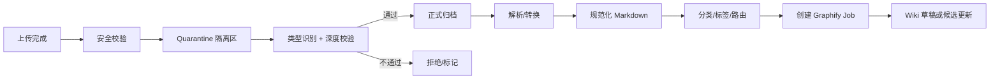

# 07. 模块需求：资料上传、归档、解析

## 1. 模块定位

资料上传模块负责把原始资料转化为 Graphify Wiki 的输入。它不是知识库检索入口，而是知识生产入口。

核心链路：

```text
上传文件/链接
  → 安全校验
  → 不可变归档
  → 去重与元数据登记
  → 解析/转换
  → 分类与路由到 Space
  → Graphify 任务
  → Wiki 草稿/候选更新
  → 人工修订/发布
```

## 2. 支持资料类型

Phase 1 支持：

| 类型 | 扩展名/输入 | 处理 |
|---|---|---|
| Markdown | `.md`, `.mdx` | 直接进入解析材料。 |
| 文本文档 | `.txt`, `.rst` | 转 Markdown。 |
| PDF | `.pdf` | 提取文本，必要时 OCR。 |
| Office | `.docx`, `.pptx`, `.xlsx` | 转 Markdown/表格文本。 |
| 图片 | `.png`, `.jpg`, `.jpeg`, `.webp` | 视觉模型或 OCR 转说明。 |
| ZIP | `.zip` | 解压后按白名单处理。 |
| 网页链接 | URL | 抓取快照，转 Markdown。 |

P1 支持：

- 音频。
- 视频。
- 代码仓库。
- Sitemap。
- Git repo clone。

## 3. 上传入口

### 3.1 Cherry Web 上传中心

- 选择 Space。
- 拖拽上传。
- 填写来源、作者、标签、保密等级。
- 选择处理策略：立即 Graphify / 暂存 / 仅归档。
- 查看任务状态。

### 3.2 Docmost 页面附件

- 用户在 Docmost 页面上传附件。
- Bridge 将附件同步到 Source Archive。
- 附件与页面绑定。
- 触发解析和 Graphify 更新。

### 3.3 管理后台批量导入

- 批量上传 ZIP。
- 导入历史资料。
- 指定目录结构映射到 Space/页面层级。

## 4. Source Archive

### 4.1 存储原则

1. 原始文件不可变。
2. 文件内容按 SHA256 全局去重（`file_blobs` 表，`tenant_id + sha256` 唯一）。
3. 同一文件可被多个 Space 引用（`source_documents` 表，每个 Space 独立记录，`space_id + file_blob_id` 唯一）。
4. 保留上传者、上传时间、来源、Space、标签。
5. 保留解析产物和 Graphify 运行关联。
6. 支持生命周期管理和备份。

### 4.2 路径规则

```text
archive/
  tenant_id/
    space_id/
      yyyy/mm/dd/
        sha256_original_filename.ext
        sha256.metadata.json
        sha256.parsed.md
        sha256.preview.txt
```

### 4.3 元数据

```json
{
  "source_document_id": "src_001",
  "tenant_id": "tenant_001",
  "space_id": "space_rd",
  "uploader_id": "user_001",
  "original_filename": "SSO设计说明.pdf",
  "mime_type": "application/pdf",
  "sha256": "...",
  "size_bytes": 123456,
  "source_type": "upload",
  "classification": "internal",
  "status": "parsed",
  "created_at": "2026-04-27T10:00:00Z"
}
```

## 5. 安全校验

Phase 1 必须实现：

1. 文件大小限制。
2. MIME 和扩展名白名单。
3. SHA256 文件级去重（相同内容不重复存储，但允许跨 Space 引用）。
4. ZIP 解压安全：禁止路径穿越、限制层级、限制总大小。
5. 上传权限校验。

P1 实现：

1. 病毒扫描。
2. 敏感信息标记。
3. DLP 规则。
4. 内容安全策略。

## 6. 解析流程



### 6.1 文件隔离（Quarantine）

上传文件**不直接进入正式归档**，先进入 quarantine 隔离区：

```text
quarantine/
  tenant_id/
    space_id/
      {upload_id}_{original_filename}
```

Quarantine 阶段执行：

| 检查项 | 说明 |
|---|---|
| MIME 真实性验证 | magic bytes vs 声明的 Content-Type |
| 文件大小确认 | 与 Content-Length 一致 |
| ZIP 安全扫描 | 路径穿越、嵌套层级、解压后总大小 |
| 扩展名白名单 | 内容与扩展名匹配 |
| 重复检测 | SHA256 查重 |
| 病毒扫描（P1） | ClamAV 或等效 |

通过后移入正式 archive 路径；不通过则标记 `security_rejected`，原文件保留 7 天后自动清除。

### 6.2 解析沙箱

PDF / Office / 图片 / ZIP 的解析**禁止在 cherry-api 容器内执行**。解析在独立的 `ingestion-worker` 容器中运行，具备以下隔离措施：

| 措施 | 说明 |
|---|---|
| 独立容器 | ingestion-worker 与 cherry-api 进程隔离 |
| 无网络外联 | 解析阶段容器不允许外网出站（除 MinIO） |
| 临时工作目录 | 每个 job 使用独立 tmpdir，完成后清除 |
| 资源限制 | 单 job 内存上限 2GB、CPU 2 cores、磁盘 5GB |
| 超时 kill | 单文件解析超时 300s 强制终止 |
| 无特权 | 容器以非 root 用户运行，无 host mount |

> **注意**：ingestion-worker 的"无网络外联"原则不变。URL 抓取由独立的 `url-fetcher-worker` 执行（见 §6.2A），抓取完成后将快照文件投递到 ingestion-worker 的输入队列，ingestion-worker 按普通文件解析。

### 6.2A URL 抓取沙箱（url-fetcher-worker）— Phase 1 P0

URL 抓取**必须在独立容器 `url-fetcher-worker` 中执行**，不允许在 ingestion-worker 或 cherry-api 中执行。这是 SSRF 防护的架构保障（威胁模型 T3，Phase 1 Critical）。

| 措施 | 说明 |
|---|---|
| 独立容器 | `url-fetcher-worker`，与 ingestion-worker 和 cherry-api 完全隔离 |
| 独立 egress proxy | 仅允许 HTTP/HTTPS（80/443）出站到公网，经代理转发 |
| 禁止私网 IP | 解析 URL 后校验 IP：禁止 localhost、10/8、172.16/12、192.168/16、169.254/16、::1 |
| 每跳 redirect 校验 | 跟随重定向前重新解析目标 IP，任一跳命中私网立即中止 |
| DNS pinning | 解析后锁定 IP，防止 DNS rebinding 攻击 |
| 响应体大小限制 | 最大 50MB（可通过 Space 配置调整） |
| 超时限制 | 连接 10s，总超时 30s |
| 不携带内部凭据 | 不注入内部 header、cookie、auth token |
| 非 root 运行 | `user: "1000:1000"`，`no-new-privileges`，`cap_drop: ALL` |
| 输出 | 抓取的 HTML/内容存为快照文件，投递到 ingestion-worker 输入队列 |

抓取链路：

```text
用户提交 URL
  → cherry-api 校验 URL 格式 + 协议白名单（仅 http/https）
  → 创建 url_fetch job，投递到 url-fetcher-worker 队列
  → url-fetcher-worker：DNS 解析 → IP 校验 → 经 egress proxy 抓取 → 快照存入 MinIO
  → 创建 ingestion job，投递到 ingestion-worker 队列
  → ingestion-worker：按普通文件解析快照（无网络外联）
```

### 6.3 文件大小分层策略

| 分层 | 文件大小 | 处理策略 | 优先级 |
|---|---|---|---|
| Small | ≤ 5MB | 同步校验 + 异步解析（用户感知快） | high |
| Medium | 5MB - 50MB | 全异步，返回 job_id 轮询 | normal |
| Large | > 50MB | 需管理员审批或自动降级为低优先级队列 | low |

Large 文件附加规则：
- 超过 200MB 直接拒绝（可通过 Space 配置调整上限）
- Large 文件解析 job 在队列中排在 Small/Medium 之后
- 管理员可配置 Space 级别的 large_file_policy：`auto_low_priority` / `require_approval` / `reject`

## 7. 解析产物规范

解析后产物需要满足 Graphify 输入要求：

```markdown
---
source_document_id: src_001
original_filename: SSO设计说明.pdf
source_type: upload
uploaded_by: user_001
space_id: space_rd
sha256: abc123...
parsed_md_hash: def456...
parsed_at: 2026-04-27T10:05:00Z
extraction_tool: "pdfplumber"
extraction_tool_version: "0.10.3"
extraction_params:
  ocr_enabled: true
  ocr_lang: "chi_sim+eng"
  table_strategy: "lines"
---

# SSO设计说明

## 摘要
...

## 正文
...

## 表格
...

## 图片说明
...
```

### 7.1 解析产物元数据

每个解析产物（`sha256.parsed.md`）必须记录以下追溯信息：

| 字段 | 类型 | 说明 |
|---|---|---|
| `parsed_md_hash` | string | 解析产物的 SHA256，用于检测解析结果是否变化 |
| `preview_hash` | string | 预览文本（前 500 字）的 hash，用于快速对比 |
| `extraction_tool` | string | 解析工具标识（pdfplumber / pandoc / tesseract / vision-model） |
| `extraction_tool_version` | string | 工具版本号，用于判断是否需要重新解析 |
| `extraction_params` | object | 解析参数（OCR 语言、表格策略等） |
| `extraction_duration_ms` | int | 解析耗时 |
| `page_count` | int | 原文件页数（PDF/Office 适用） |
| `char_count` | int | 提取后字符数 |
| `image_count` | int | 提取的图片数量 |

当 `extraction_tool_version` 有重大升级时，管理员可批量触发重新解析（`reprocess`），系统对比新旧 `parsed_md_hash`，仅变化的文件触发后续 Graphify 更新。

## 8. 自动归档分类

分类维度：

| 维度 | 示例 |
|---|---|
| Space | 研发平台、法务、销售。 |
| 主题 | 认证、部署、合同、客户案例。 |
| 文件类型 | 制度、设计文档、FAQ、会议纪要。 |
| 来源 | 上传、网页、Docmost 附件、Git。 |
| 状态 | raw、parsed、graphified、published。 |

分类结果可以自动生成 Wiki 路径建议：

```text
space_rd/auth/sso-design.md
space_rd/deployment/docker-compose.md
```

## 9. Graphify 触发策略

| 场景 | 策略 |
|---|---|
| 单个小文件上传 | 立即增量更新。 |
| 批量上传 | 批处理，合并为一个 Graphify run。 |
| 大文件上传 | 后台异步处理，通知用户。 |
| Docmost 附件上传 | 与页面绑定后增量更新。 |
| 链接导入 | 先快照，再处理。 |

## 10. 任务状态

```text
uploaded
  → archived
  → parsing
  → parsed
  → graphify_pending
  → graphify_running
  → wiki_proposed
  → published
  → indexed
```

失败状态：

```text
parse_failed
security_rejected
graphify_failed
sync_failed
index_failed
```

### 10.1 失败策略

| 失败类型 | 原文件处理 | 后续动作 | 可恢复 |
|---|---|---|---|
| `security_rejected` | quarantine 保留 7 天后清除 | 不归档、不解析、不触发 Graphify | 否 |
| `parse_failed` | **保留在正式 archive** | 不触发 Graphify；标记 `needs_attention`；可手动重试或换工具 | 是（reprocess） |
| `graphify_failed` | 保留，解析产物保留 | 不影响 Wiki；Graphify run 进入 failed/quarantine | 是（retry run） |
| `sync_failed` | 保留 | 重试 Docmost 同步 | 是（auto retry 3x） |
| `index_failed` | 保留 | 重试索引构建 | 是（auto retry 3x） |

核心原则：
1. **原文件永不因解析失败而丢失** — `parse_failed` 的文件仍在 archive 中可访问
2. **解析失败不触发 Graphify** — 避免把空/错误的 parsed.md 送入图谱生成
3. **失败原因可审计** — 每次失败记录 `error_json`（含工具 stderr、exit code、异常 stack）
4. **用户可见** — 上传中心显示失败文件列表，支持"重新解析"操作
5. **不阻塞其他文件** — 批量上传中单个文件失败不影响其余文件处理

## 11. 与唯一知识源原则的关系

上传资料在系统中的地位：

- 可以作为 Graphify 输入。
- 可以作为 Wiki 页面证据。
- 可以作为审计和回溯材料。
- 不可以绕过 Wiki 直接进入 Chat 检索。
- 不可以作为无页面引用的答案来源。

## 12. Phase 1 验收

1. 用户可以上传 PDF/DOCX/MD/TXT/ZIP。
2. 上传后文件进入 Source Archive。
3. 系统生成解析产物。
4. 解析产物触发 Graphify job。
5. Graphify 产生 Wiki 页面或候选更新。
6. 页面可在 Cherry Web 内置只读 Wiki 中查看。
7. 发布后 Chat 可检索该页面。
8. 原文件可从页面证据处查看，但不作为直接检索源。

### Phase 2 验收（本阶段不做）

- 页面可在 Docmost 查看和编辑。
